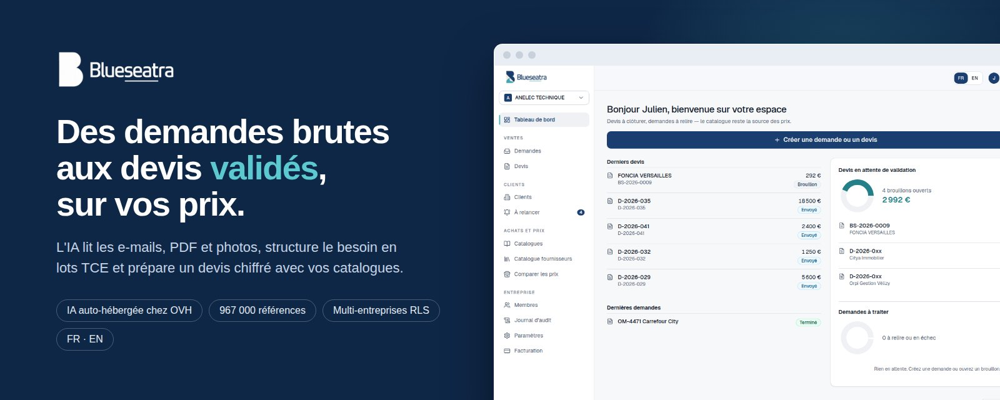

 

**AI-assisted quoting software for building-services, maintenance and fit-out contractors.**

 

[**Website**](https://blueseatra.com) · [**Documentation (FR)**](./docs/README.md) · [**User manual (FR)**](./docs/manuel-utilisateur.md) · [**API**](./docs/reference-api.md) · [**Français**](./README.md)

---

## What it does

1. **Read.** Emails, PDFs and site photos are read by a self-hosted AI. It extracts the principal, the end client, the site, the urgency and the work items, then organises them into trade packages.
2. **Price.** Each line is matched against your own catalogue and about 967,000 references from 9 French distributors. Margins, discounts and French construction VAT are computed by fixed rules. The AI never sets a price.
3. **Follow up.** Validated quotes are exported as Pro Forma PDFs. Follow-ups are scheduled in French working days, and each outcome (accepted, declined, no follow-up) is tracked per client.

## Features

- AI extraction with an OCR cascade and a sequential queue.
- Quote editor with packages, labour, travel and notes, and 20 / 10 / 5.5 / 0 % VAT.
- Custom catalogue import from any CSV layout, with versioning.
- Shared supplier catalogue and price comparison.
- Clients module: records, contacts, sites, activity log, AI suggestions with evidence, follow-ups, GDPR opt-out and anonymisation.
- Multi-tenant roles with PostgreSQL row-level security.
- Plans and usage metering.
- French and English interface.

## Stack

React 18 and Tailwind CSS on Hostinger · FastAPI (Python 3.11) on Render · PostgreSQL 17 on Supabase with RLS · Ollama on an OVH VPS. See [architecture](./docs/architecture.md).

The detailed documentation is written in French.

---

© 2025-2026 Blueseatra. Proprietary code, all rights reserved.

