<div align="center">


<br>

**AI-assisted quoting software for building-services, maintenance and fit-out contractors.**

<br>

[](https://github.com/zehair-louzza/Blueseatra/actions/workflows/ci-infra.yml)
[](https://github.com/zehair-louzza/Blueseatra/actions/workflows/securite.yml)
[](https://github.com/zehair-louzza/Blueseatra/actions/workflows/tests-metier.yml)
[](https://blueseatra.com)
[](./CHANGELOG.md)
[](./LICENSE)


[**Website**](https://blueseatra.com) ·
[**User manual (FR)**](./docs/manuel-utilisateur.md) ·
[**Documentation (FR)**](./docs/README.md) ·
[**Architecture (FR)**](./docs/architecture.md) ·
[**API**](./docs/reference-api.md) ·
[**Changelog (FR)**](./CHANGELOG.md) ·
[**Français**](./README.md)

</div>

---

## Why Blueseatra

An estimator spends hours retyping work orders, looking up prices and chasing clients. Blueseatra automates the reading and the formatting, and never lets the AI decide a price.

<table>
<tr>
<td width="33%" valign="top">

### Read
An email, a PDF, a site photo: the AI identifies the principal, the end client, the site, the urgency and the work, then sorts the work into **trade packages**.

</td>
<td width="33%" valign="top">

### Price
Lines are matched against **your catalogue** and about **967,000 references** from 9 French distributors. Margins, discounts and French construction VAT are computed by fixed rules.

</td>
<td width="33%" valign="top">

### Follow up
The validated quote goes out as a Pro Forma PDF; **follow-ups in working days** and the commercial outcome are then tracked client by client.

</td>
</tr>
</table>

## Overview

<table>
<tr>
<td width="50%">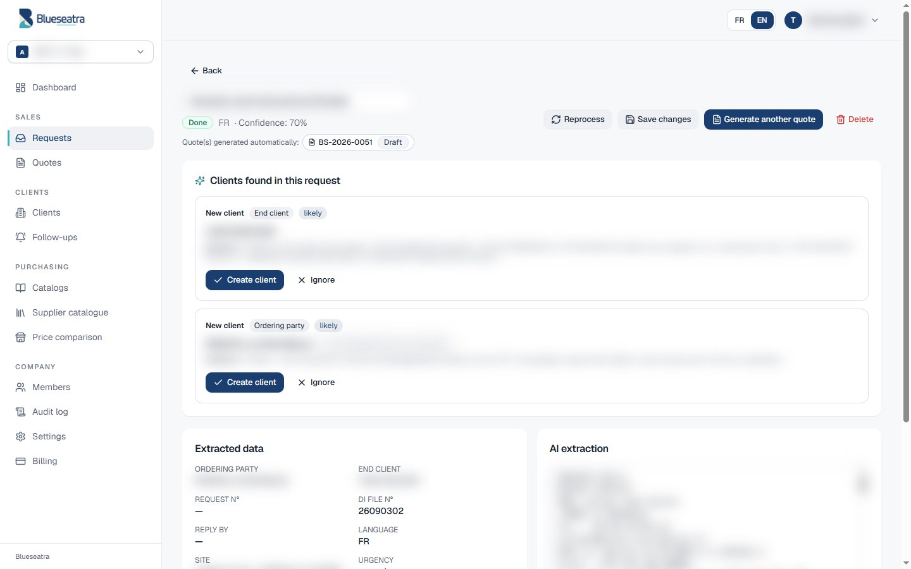<br><sub><b>Request read by the AI</b>: extracted data, source text and detected clients with their evidence</sub></td>
<td width="50%">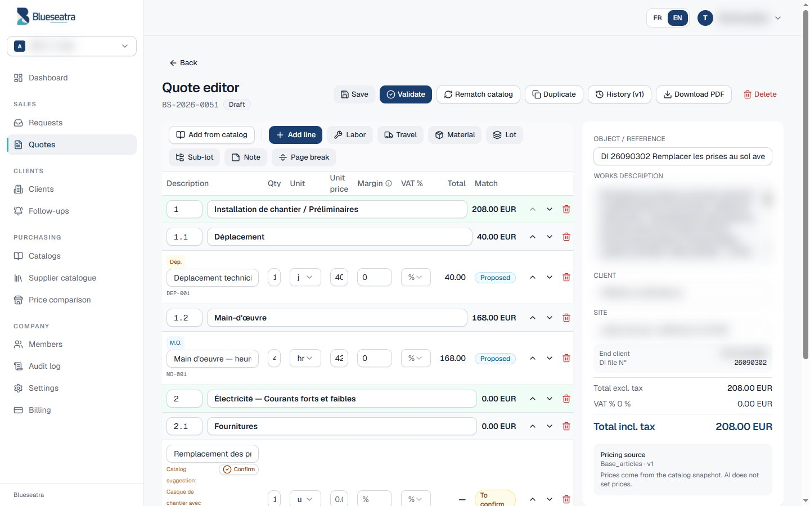<br><sub><b>Quote editor</b>: numbered packages, labour, travel, frozen price source</sub></td>
</tr>
<tr>
<td width="50%">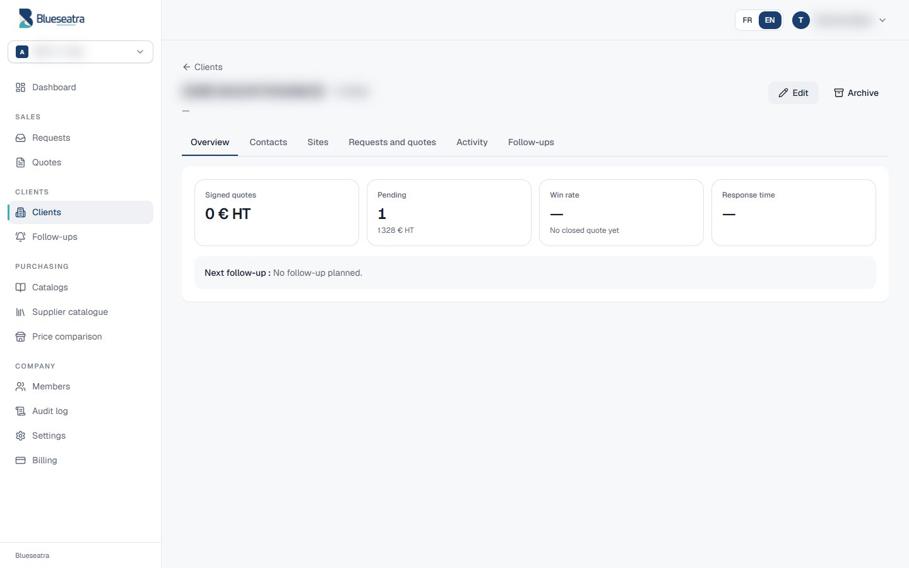<br><sub><b>Client record</b>: contacts, sites, requests and quotes, activity, follow-ups</sub></td>
<td width="50%">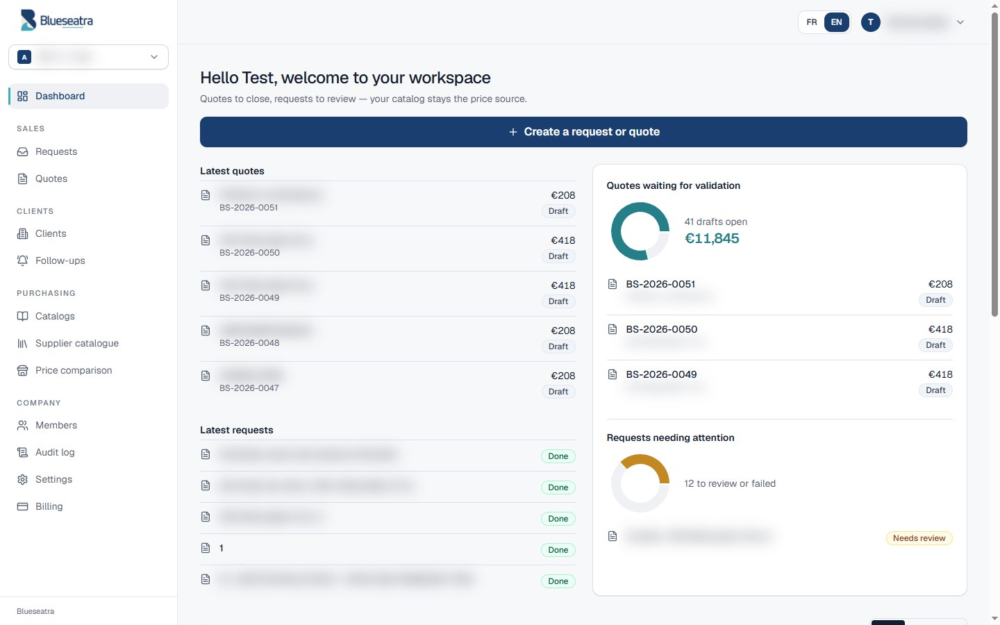<br><sub><b>Dashboard</b>: quotes waiting for validation, requests needing attention</sub></td>
</tr>
<tr>
<td width="50%">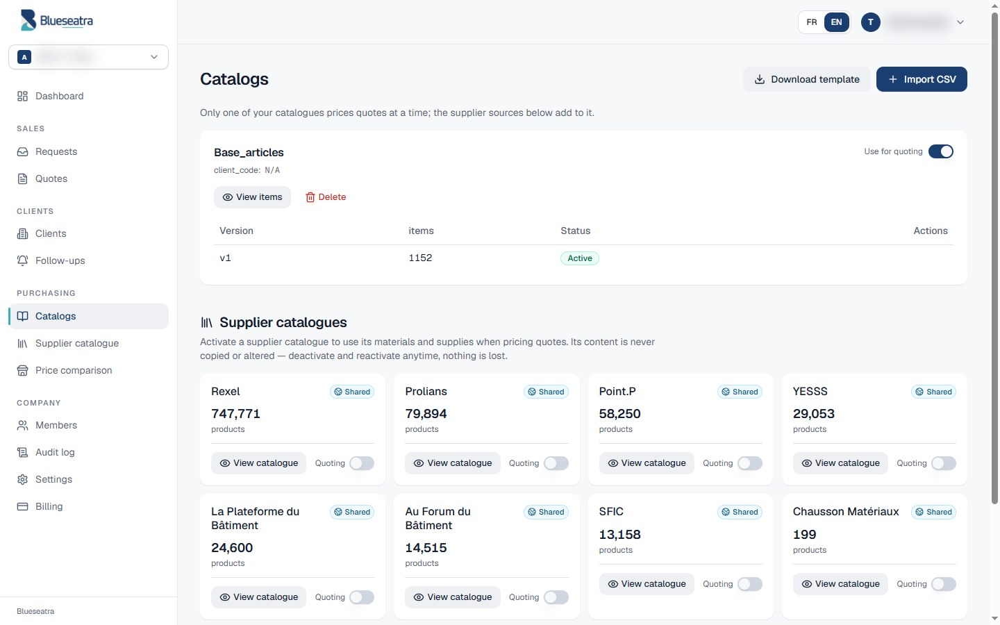<br><sub><b>Catalogues</b>: your price catalogue and the supplier catalogues you switch on for quoting</sub></td>
<td width="50%">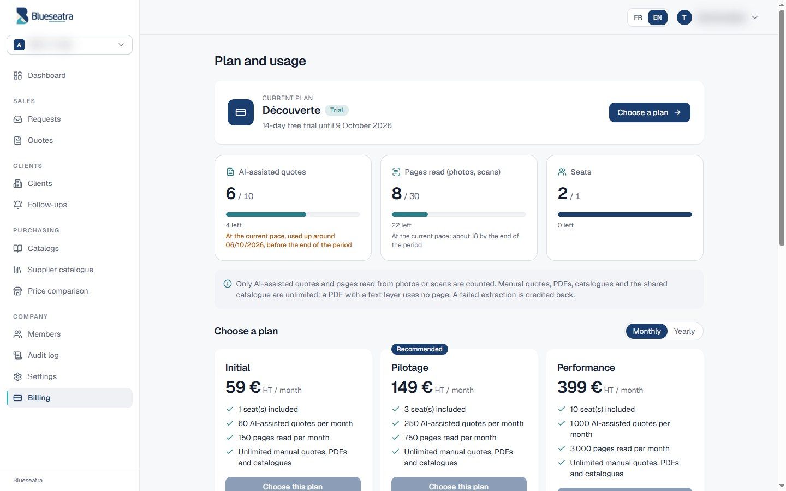<br><sub><b>Plan and usage</b>: only automated work is counted</sub></td>
</tr>
<tr>
<td width="50%">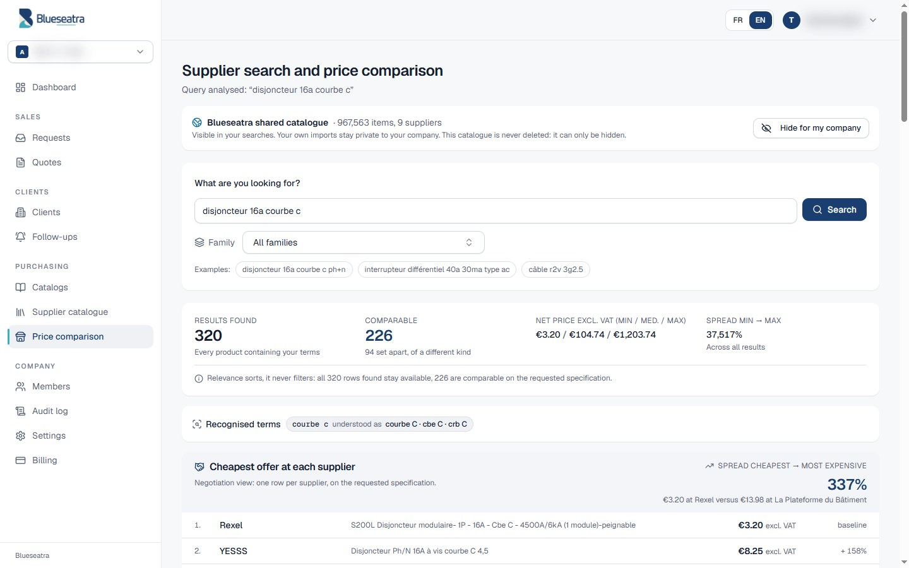<br><sub><b>Price comparison</b>: cheapest offer at each supplier, family filter, recognised trade terms</sub></td>
<td width="50%">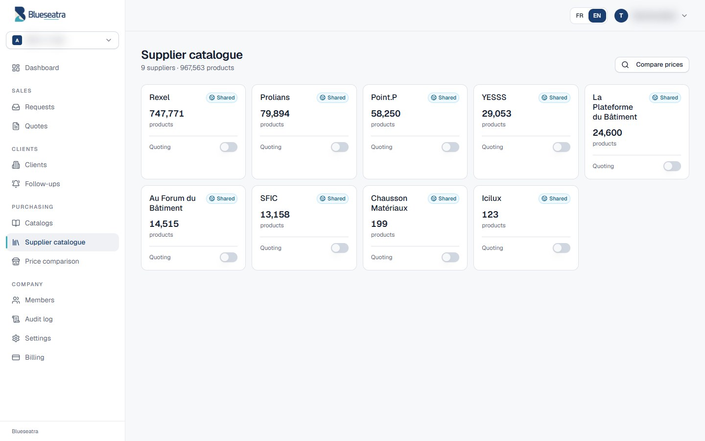<br><sub><b>Supplier catalogue</b>: shared supplier catalogues, each switched on or off for quoting</sub></td>
</tr>
</table>

<sub>English interface. Personal data is masked. Product descriptions, families and sample queries stay in French: they come from, and must match, French supplier catalogues.</sub>

## Features

| Area | What is delivered | Status |
|---|---|:---:|
| **AI reading** | PDF, DOCX, XLSX, CSV, TXT, images; OCR cascade; sequential extraction queue; confidence score; draft generated automatically | ✅ |
| **Quotes** | Packages and sub-packages, materials, labour, travel, notes; 20 / 10 / 5.5 / 0 % VAT; hidden margin; variants; Pro Forma PDF | ✅ |
| **Custom catalogues** | CSV import in any layout, column mapping, versions, atomic activation, large files | ✅ |
| **Supplier catalogue** | Rexel, Prolians, Point.P, YESSS, La Plateforme du Bâtiment, Au Forum du Bâtiment, SFIC, Chausson, Icilux; shared, can be hidden, never deleted; search by word and by family inside each catalogue | ✅ |
| **Quoting on activatable sources** | Each supplier catalogue can be switched on or off for quoting (toggle, content kept); without an internal catalogue, activated sources generate the quote; fast search under RLS (trigram index through secured functions) | ✅ |
| **Price comparison** | Cheapest offer per supplier, criteria isolated, equivalent terms recognised ("courbe c", "2p", "ph+n"…), filter by product family | ✅ |
| **Clients** | Records, contacts, sites, activity log, CSV import and export, indicators | ✅ |
| **AI suggestions** | Principal and end client proposed with the source sentence; automatic linking only on an identical SIRET or email | ✅ |
| **Follow-ups** | Working days and public holidays, urgency, expiry reminder, phone call above a threshold, GDPR opt-out, FR / EN texts | ✅ |
| **Multi-company** | Roles owner, admin, operator, viewer, billing_admin; company switcher; PostgreSQL RLS | ✅ |
| **Plans and quotas** | Découverte, Initial, Pilotage, Performance, Signature; append-only usage ledger; blocking can be switched on (`BLUESEATRA_QUOTAS_APPLIQUES`) | ✅ |
| **Integrations** | n8n webhook per company, MCP bridge, choice of AI engine | ✅ |
| **Online payment** | Stripe | 🔜 ticket #90 |

## Quick start

```bash
git clone https://github.com/zehair-louzza/Blueseatra.git && cd Blueseatra

# API
cd backend && python -m venv .venv && source .venv/bin/activate
pip install -r requirements.txt
cp .env.example .env        # set DATABASE_URL, JWT_SECRET, APP_ENCRYPTION_KEY, HERMES_BASE_URL
uvicorn server:app --port 8001 --reload

# Website
cd ../frontend && npm install --legacy-peer-deps
REACT_APP_BACKEND_URL=http://localhost:8001 npm start
```

Details (variables, local database, tests) are in the [developer guide (FR)](./docs/guide-developpeur.md).

## Architecture

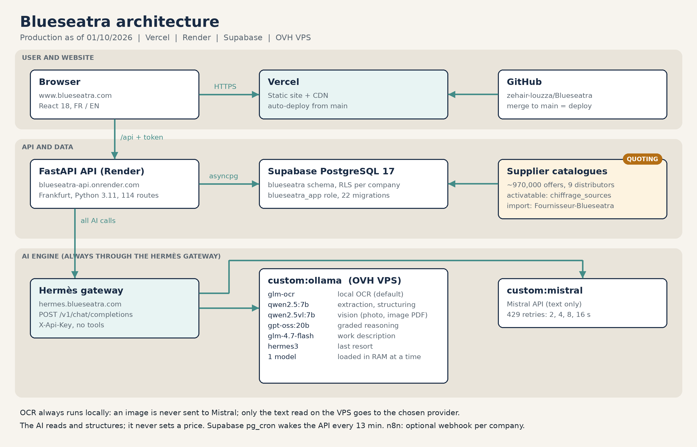

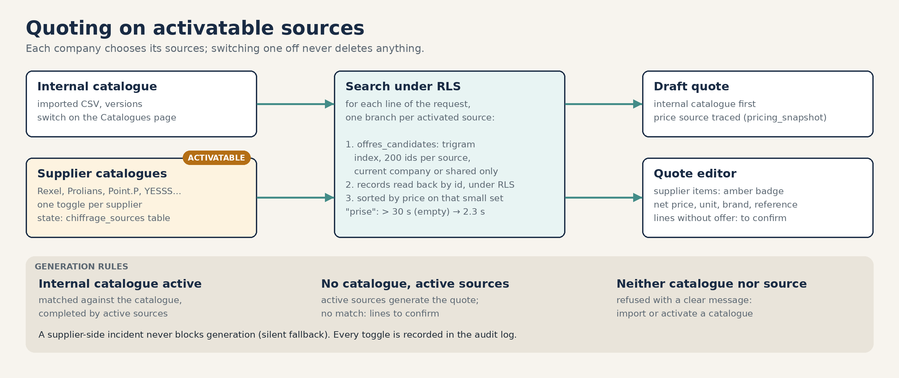

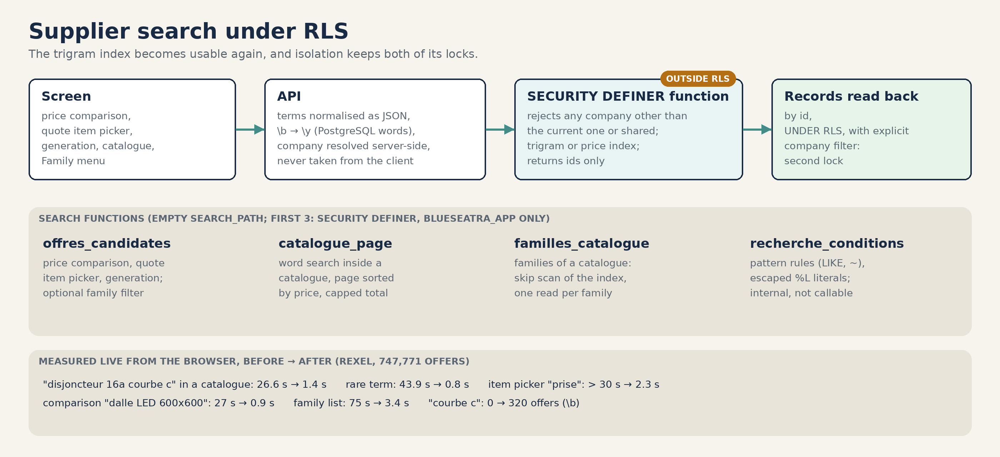


<details>
<summary>Text view (Mermaid)</summary>

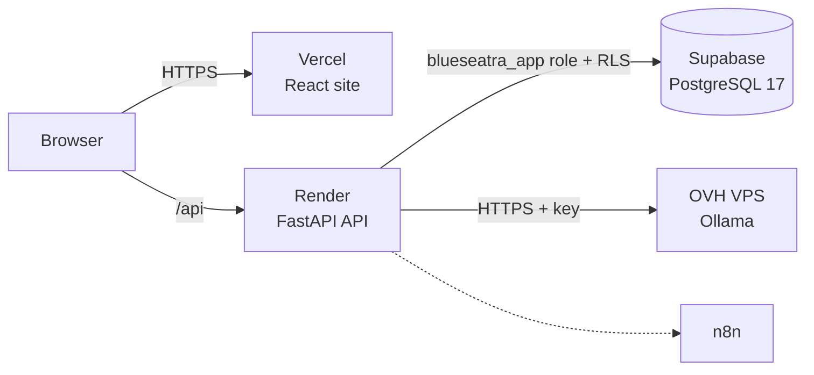

</details>

**Principles**
- The AI never sets a price.
- Each company is isolated in the code and in the database; the few functions that bypass RLS (search) check the company themselves.
- Nothing is deleted silently.
- A quote only goes out after human validation.

Details: [architecture.md (FR)](./docs/architecture.md).

## Documentation

The detailed documentation is written in French.

| For | Document |
|---|---|
| Using the application | [User manual](./docs/manuel-utilisateur.md) |
| Understanding the system | [Architecture](./docs/architecture.md) · [Decisions (ADR)](./docs/decisions) |
| Developing | [Developer guide](./docs/guide-developpeur.md) · [API reference](./docs/reference-api.md) · [Contributing](./CONTRIBUTING.md) |
| Running in production | [Operations](./docs/exploitation.md) · [DEPLOIEMENT.md](./DEPLOIEMENT.md) |
| Plans and pricing | [Pricing](./docs/tarification-2026-09.md) |
| Clients module | [Specification](./docs/specs/module-clients.md) |
| Security | [SECURITY.md](./SECURITY.md) · [Isolation audit](./docs/audit-isolation-tenants-2026-09-12.md) |
| Everything else | [Documentation index](./docs/README.md) |

## Quality and security

| Check | Where |
|---|---|
| Isolation between companies (static and live) | `backend/tests_security`, workflow `securite.yml` |
| Search functions under RLS: isolation, injection, permissions, exactness (disposable database) | `backend/tests_security/test_offres_candidates_sql.py`, workflow `tests-metier.yml` |
| Follow-up rules, quotas, Clients migration on PostgreSQL 17 | `backend/tests_clients`, `backend/tests_quotas`, workflow `tests-metier.yml` |
| Lint, migration consistency, secret scanning | workflow `ci-infra.yml` |
| Mandatory review of sensitive areas | [`CODEOWNERS`](./.github/CODEOWNERS) |
| Companies' AI secrets encrypted (Fernet), bcrypt passwords, JWT | `backend/server.py` |

## Ecosystem

| Repository | Role |
|---|---|
| **Blueseatra** (this repository) | Application: API, website, database |
| [ovh-ai-stack](https://github.com/zehair-louzza/ovh-ai-stack) | Self-hosted AI engine (Ollama, Caddy, monitoring) |
| [Fournisseur-Blueseatra](https://github.com/zehair-louzza/Fournisseur-Blueseatra) | Collection and normalisation of supplier price lists |

## Roadmap

- [x] Shared supplier catalogue and price comparison
- [x] Visual redesign and pricing
- [x] Usage counters (observation mode)
- [x] Clients module and follow-ups
- [x] Ledger and quotas ([#89](https://github.com/zehair-louzza/Blueseatra/issues/89)), blocking can be switched on
- [x] Fast supplier search under RLS, filter by family
- [ ] Stripe payment and top-ups ([#90](https://github.com/zehair-louzza/Blueseatra/issues/90))
- [ ] Sending follow-ups by email from Blueseatra

---

<div align="center">
<sub>© 2025-2026 Blueseatra. Proprietary code, all rights reserved. See <a href="./LICENSE">LICENSE</a>.</sub>
</div>
