<div align="center">


<br>

**Le logiciel de devis assisté par IA pour les entreprises TCE, de maintenance et de second œuvre.**

<br>

[](https://github.com/zehair-louzza/Blueseatra/actions/workflows/ci-infra.yml)
[](https://github.com/zehair-louzza/Blueseatra/actions/workflows/securite.yml)
[](https://github.com/zehair-louzza/Blueseatra/actions/workflows/tests-metier.yml)
[](https://blueseatra.com)
[](./CHANGELOG.md)
[](./LICENSE)


[**Site**](https://blueseatra.com) ·
[**Manuel d'utilisation**](./docs/manuel-utilisateur.md) ·
[**Documentation**](./docs/README.md) ·
[**Architecture**](./docs/architecture.md) ·
[**API**](./docs/reference-api.md) ·
[**Changements**](./CHANGELOG.md) ·
[**English**](./README.en.md)

</div>

---

## Pourquoi Blueseatra

Un chiffreur passe des heures à recopier des ordres de mission, retrouver des prix et relancer des clients. Blueseatra automatise la lecture et la mise en forme, sans jamais laisser l'IA décider d'un prix.

<table>
<tr>
<td width="33%" valign="top">

### Lire
Un e-mail, un PDF, une photo de chantier : l'IA repère le donneur d'ordre, le client final, le site, l'urgence et les travaux, puis les range en **lots TCE**.

</td>
<td width="33%" valign="top">

### Chiffrer
Les lignes sont rapprochées de **votre catalogue** et d'environ **967 000 références** de 9 distributeurs. Marges, remises et TVA bâtiment sont calculées par des règles fixes.

</td>
<td width="33%" valign="top">

### Suivre
Le devis validé part en PDF Pro Forma, puis les **relances en jours ouvrés** et l'issue commerciale sont suivies client par client.

</td>
</tr>
</table>

## Aperçu

<table>
<tr>
<td width="50%">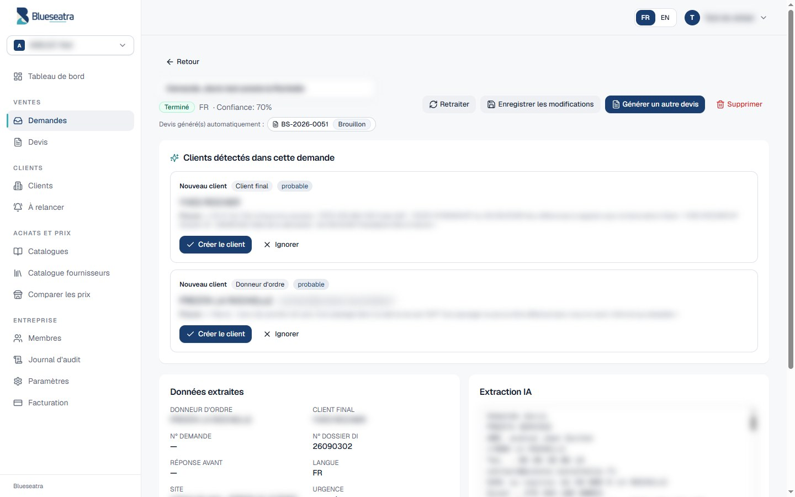<br><sub><b>Demande lue par l'IA</b> : données extraites, texte source et clients détectés avec leur preuve</sub></td>
<td width="50%">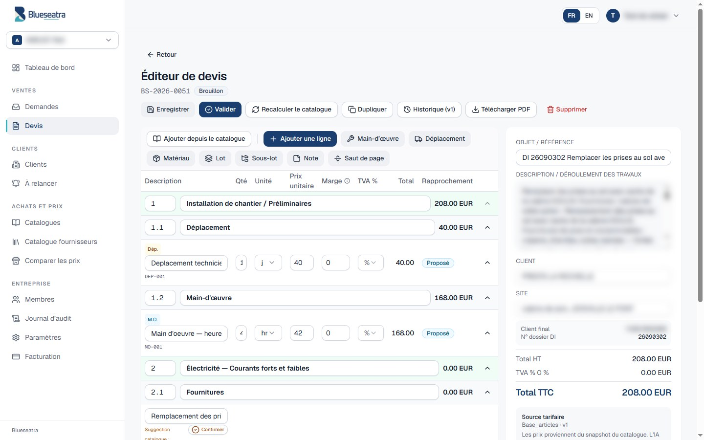<br><sub><b>Éditeur de devis</b> : lots numérotés, main-d'œuvre, déplacement, source tarifaire figée</sub></td>
</tr>
<tr>
<td width="50%">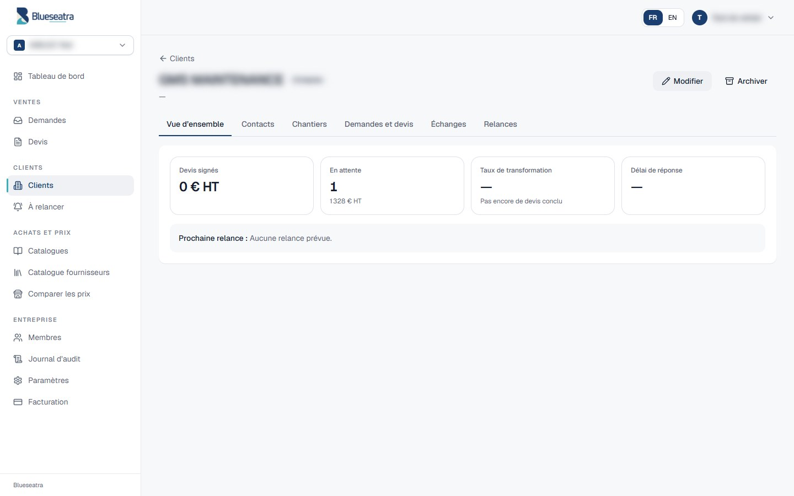<br><sub><b>Fiche client</b> : contacts, chantiers, historique, taux de transformation</sub></td>
<td width="50%">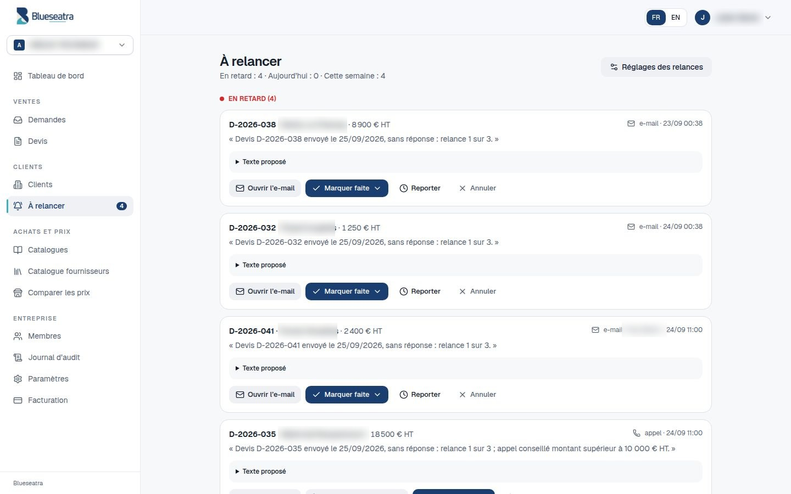<br><sub><b>À relancer</b> : relances du jour, texte proposé, résultat en un clic</sub></td>
</tr>
<tr>
<td width="50%">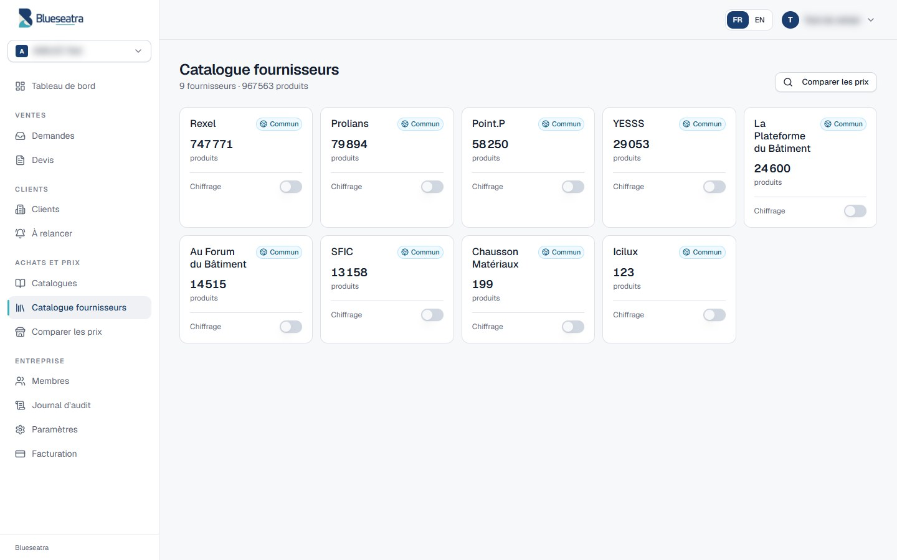<br><sub><b>Catalogue fournisseurs</b> : 9 distributeurs, familles, prix nets</sub></td>
<td width="50%">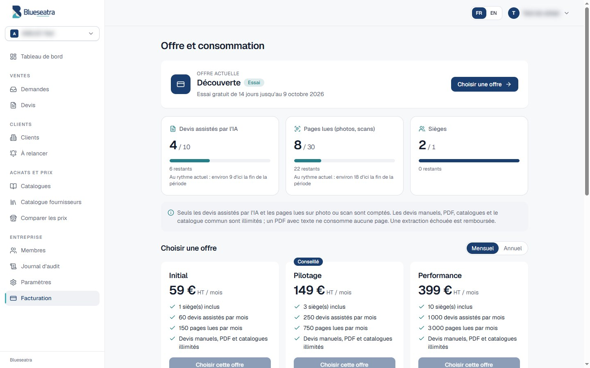<br><sub><b>Offre et consommation</b> : seul l'automatique est compté</sub></td>
</tr>
<tr>
<td width="50%">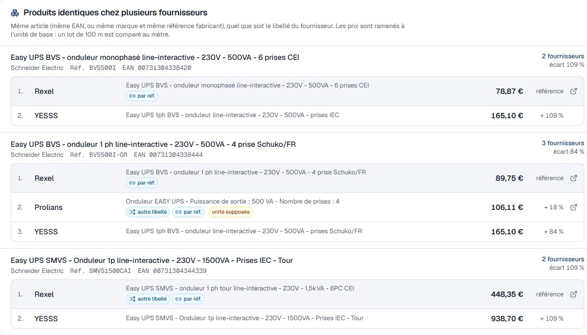<br><sub><b>Comparateur</b> : le même produit chez plusieurs fournisseurs, quel que soit son libellé, comparé par unité de base</sub></td>
<td width="50%">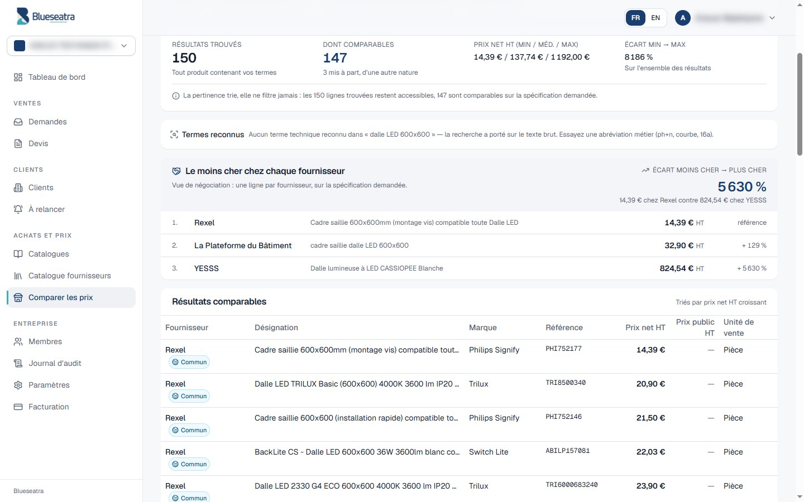<br><sub><b>Le moins cher par fournisseur</b> : termes reconnus, critères isolés, filtre par famille</sub></td>
</tr>
</table>

## Fonctionnalités

| Domaine | Ce qui est livré | État |
|---|---|:---:|
| **Lecture IA** | PDF, DOCX, XLSX, CSV, TXT, images ; cascade OCR ; file d'extraction séquentielle ; score de confiance ; brouillon généré automatiquement | ✅ |
| **Devis** | Lots et sous-lots, matériaux, main-d'œuvre, déplacement, notes ; TVA 20 / 10 / 5,5 / 0 % ; marge masquée ; variantes ; PDF Pro Forma | ✅ |
| **Catalogues sur mesure** | Import CSV ou Excel (.xlsx, .xls) de n'importe quel format, feuille et ligne d'en-tête détectées, classeurs à macros refusés, correspondance des colonnes, versions, activation atomique, fichiers volumineux | ✅ |
| **Catalogue fournisseurs** | Rexel, Prolians, Point.P, YESSS, La Plateforme du Bâtiment, Au Forum du Bâtiment, SFIC, Chausson, Icilux ; partagé, masquable, jamais supprimé ; recherche par mot et par famille dans chaque catalogue | ✅ |
| **Chiffrage sur sources activables** | Chaque catalogue fournisseur s'active ou se désactive pour le chiffrage (bouton poussoir, contenu conservé) ; sans catalogue interne, les sources activées génèrent le devis ; recherche rapide sous RLS (index trigramme via fonctions sécurisées) | ✅ |
| **Comparateur de prix** | Le moins cher par fournisseur, critères isolés, termes équivalents reconnus (« courbe c », « 2p », « ph+n »…), filtre par famille | ✅ |
| **Produits identiques entre fournisseurs** | Même article reconnu chez plusieurs fournisseurs (EAN, ou marque + réf. fabricant) même si les désignations diffèrent ; prix ramené à l'unité de base (un lot de 100 m comparé au mètre) ; anomalies signalées | ✅ |
| **Format unique des catalogues** | 971 676 offres de 9 fournisseurs nettoyées dans un format commun : GTIN vérifié, marque canonique, unité de base, prix par unité ; données source jamais modifiées | ✅ |
| **Clients** | Fiches, contacts, chantiers, journal des échanges, import et export CSV, indicateurs | ✅ |
| **Suggestions IA** | Donneur d'ordre et client final proposés avec la phrase source ; rattachement automatique seulement sur SIRET ou e-mail identique | ✅ |
| **Relances** | Jours ouvrés et fériés, urgence, rappel d'expiration, appel au-delà d'un seuil, opposition RGPD, textes FR / EN | ✅ |
| **Multi-entreprises** | Rôles owner, admin, operator, viewer, billing_admin ; sélecteur d'entreprise ; RLS PostgreSQL | ✅ |
| **Offres et quotas** | Découverte, Initial, Pilotage, Performance, Signature ; registre de consommation en ajout seul ; blocage activable (`BLUESEATRA_QUOTAS_APPLIQUES`) | ✅ |
| **Intégrations** | Webhook n8n par entreprise, pont MCP, choix du moteur IA | ✅ |
| **Paiement en ligne** | Stripe | 🔜 ticket #90 |

## Démarrage rapide

```bash
git clone https://github.com/zehair-louzza/Blueseatra.git && cd Blueseatra

# API
cd backend && python -m venv .venv && source .venv/bin/activate
pip install -r requirements.txt
cp .env.example .env        # renseigner DATABASE_URL, JWT_SECRET, APP_ENCRYPTION_KEY, HERMES_BASE_URL
uvicorn server:app --port 8001 --reload

# Site
cd ../frontend && npm install --legacy-peer-deps
REACT_APP_BACKEND_URL=http://localhost:8001 npm start
```

Le détail (variables, base locale, tests) est dans le [guide développeur](./docs/guide-developpeur.md).

## Architecture

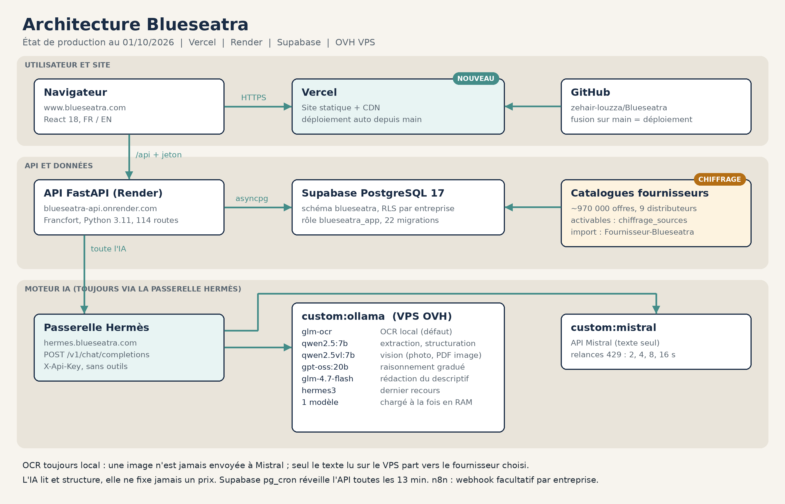


Détail des dix phases, vues Supabase et Render : [Infrastructure et parcours complet d'un devis](./docs/infrastructure.md).

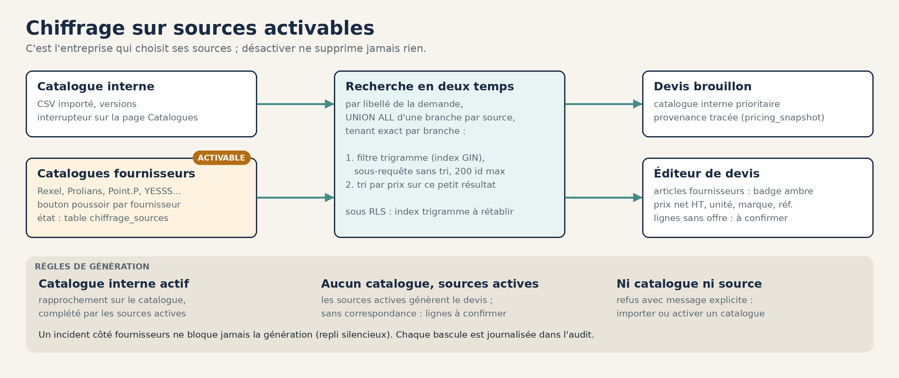

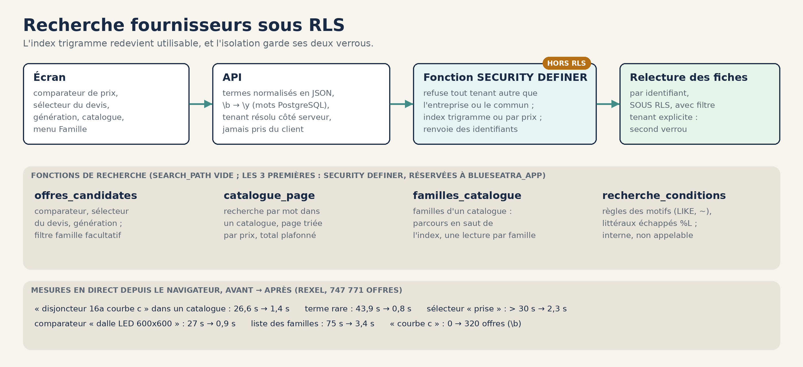

<details>
<summary>Vue texte (Mermaid)</summary>

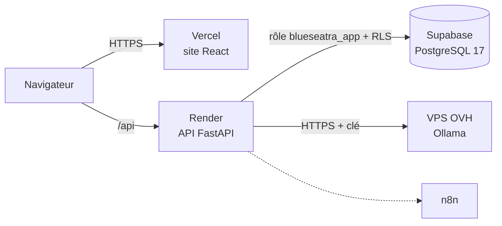

</details>

**Principes**
- L'IA ne fixe jamais un prix.
- Chaque entreprise est isolée dans le code et dans la base ; les rares fonctions qui contournent la RLS (recherche) vérifient elles-mêmes l'entreprise.
- Rien n'est supprimé en silence.
- Un devis ne part qu'après validation humaine.

Détails : [architecture.md](./docs/architecture.md).

## Documentation

| Pour | Document |
|---|---|
| Utiliser l'application | [Manuel d'utilisation](./docs/manuel-utilisateur.md) |
| Comprendre le système | [Architecture](./docs/architecture.md) · [Infrastructure et parcours complet d'un devis](./docs/infrastructure.md) · [Décisions (ADR)](./docs/decisions) |
| Développer | [Guide développeur](./docs/guide-developpeur.md) · [Référence API](./docs/reference-api.md) · [Contribuer](./CONTRIBUTING.md) |
| Mettre en production | [Exploitation](./docs/exploitation.md) · [DEPLOIEMENT.md](./DEPLOIEMENT.md) |
| Offres et prix | [Tarification](./docs/tarification-2026-09.md) |
| Module Clients | [Spécification](./docs/specs/module-clients.md) |
| Sécurité | [SECURITY.md](./SECURITY.md) · [Audit d'isolation](./docs/audit-isolation-tenants-2026-09-12.md) |
| Tout le reste | [Index de la documentation](./docs/README.md) |

## Qualité et sécurité

| Contrôle | Où |
|---|---|
| Isolation entre entreprises (statique et réelle) | `backend/tests_security`, workflow `securite.yml` |
| Fonctions de recherche sous RLS : isolation, injection, droits, exactitude (base jetable) | `backend/tests_security/test_offres_candidates_sql.py`, workflow `tests-metier.yml` |
| Règles de relance, quotas, migration Clients sur PostgreSQL 17 | `backend/tests_clients`, `backend/tests_quotas`, workflow `tests-metier.yml` |
| Lint, cohérence des migrations, recherche de secrets | workflow `ci-infra.yml` |
| Relecture obligatoire des zones sensibles | [`CODEOWNERS`](./.github/CODEOWNERS) |
| Secrets IA des entreprises chiffrés (Fernet), mots de passe bcrypt, JWT | `backend/server.py` |

## Écosystème

| Dépôt | Rôle |
|---|---|
| **Blueseatra** (ce dépôt) | Application : API, site, base |
| [ovh-ai-stack](https://github.com/zehair-louzza/ovh-ai-stack) | Moteur IA auto-hébergé (Ollama, Caddy, supervision) |
| [Fournisseur-Blueseatra](https://github.com/zehair-louzza/Fournisseur-Blueseatra) | Collecte et normalisation des tarifs fournisseurs |

## Feuille de route

- [x] Catalogue fournisseurs commun et comparateur
- [x] Refonte visuelle et tarification
- [x] Compteurs de consommation (mode observation)
- [x] Module Clients et relances
- [x] Registre et quotas ([#89](https://github.com/zehair-louzza/Blueseatra/issues/89)), blocage activable
- [x] Recherche fournisseurs rapide sous RLS, filtre par famille
- [ ] Paiement Stripe et recharges ([#90](https://github.com/zehair-louzza/Blueseatra/issues/90))
- [ ] Envoi des relances par e-mail depuis Blueseatra

---

<div align="center">
<sub>© 2025-2026 Blueseatra. Code propriétaire, tous droits réservés. Voir <a href="./LICENSE">LICENSE</a>.</sub>
</div>
