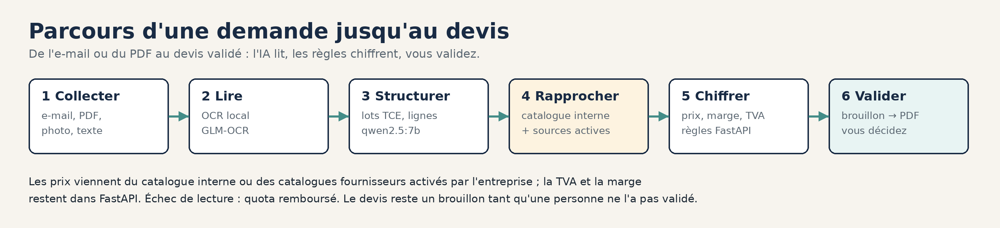
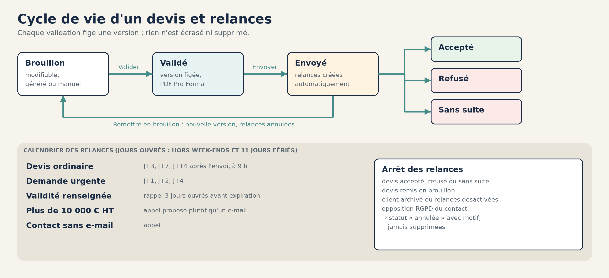
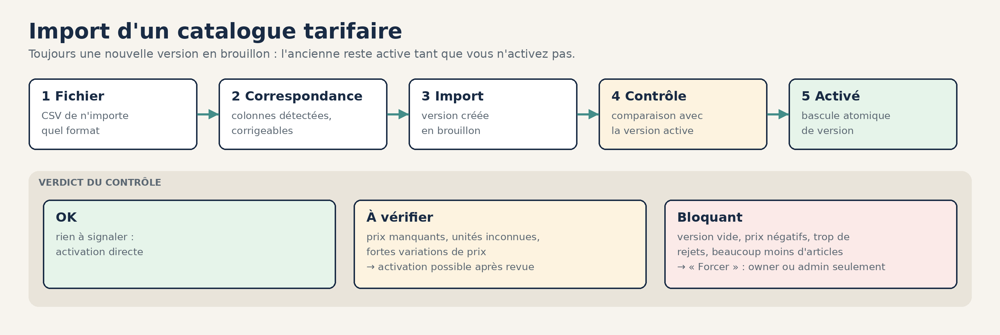
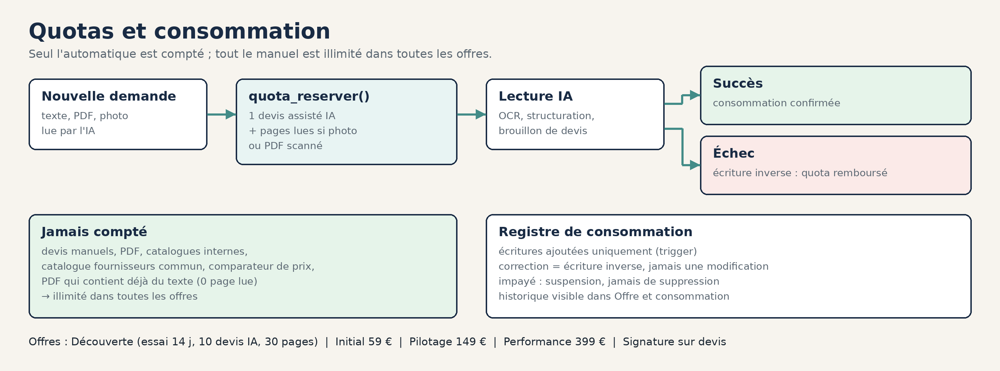
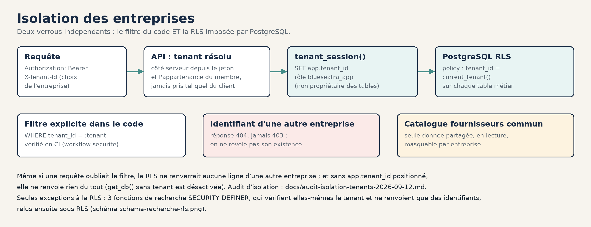
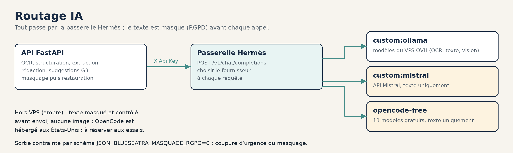
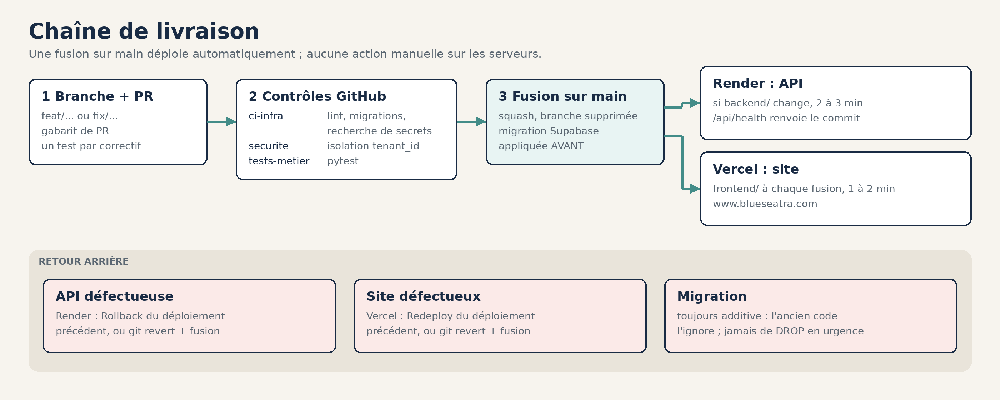
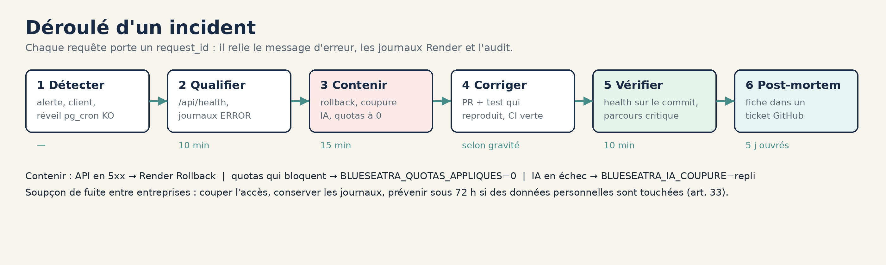

# Documentation Blueseatra

Toute la documentation du projet, classée par usage.

## Schémas

| | |
|---|---|
|  |  |
| **Architecture** : Vercel, Render, Supabase, passerelle Hermès | **Parcours** : de la demande au devis validé |
|  |  |
| **Chiffrage** : catalogue interne et sources fournisseurs activables | **Devis et relances** : statuts, calendrier, arrêt |
|  |  |
| **Import de catalogue** : 5 étapes et verdict du contrôle | **Quotas** : réservation, remboursement, ce qui n'est jamais compté |
|  |  |
| **Isolation** : filtre du code et RLS PostgreSQL | **Routage IA** : tout passe par la passerelle Hermès |
|  |  |
| **Livraison** : PR, contrôles, déploiement, retour arrière | **RGPD** : droits des personnes et traçabilité |
|  |  |
| **Incident** : détecter, contenir, corriger, vérifier | |

Les schémas sont générés par [`scripts/docs/generer_schemas.py`](../scripts/docs/generer_schemas.py) et la bannière par [`scripts/docs/generer_banniere.py`](../scripts/docs/generer_banniere.py).

## Utiliser

| Document | Contenu |
|---|---|
| [Manuel d'utilisation](./manuel-utilisateur.md) | Chaque écran, pas à pas, avec captures : demandes, devis, catalogues, clients, relances, membres, paramètres, offre |
| [Tarification](./tarification-2026-09.md) | Offres, quotas, règles multi-entreprises |
| [Blueseatra_Documentation_FR.pdf](./Blueseatra_Documentation_FR.pdf) · [EN](./Blueseatra_Documentation_EN.pdf) | Présentation générale (PDF) |

## Comprendre

| Document | Contenu |
|---|---|
| [Architecture](./architecture.md) | Vue générale, parcours d'une demande, modules, modèle de données |
| [Infrastructure et parcours complet](./infrastructure.md) · [EN](./infrastructure.en.md) | Les dix phases d'un devis (qui agit, qui réagit), vues Supabase et Render, points d'attention |
| [Schéma de base de données](./schema-base-donnees.md) | Tables et colonnes du chiffrage et des devis, état au 01/10/2026 |
| [ADR : moteur IA sur OVH](./decisions/ADR-OVH-AI-STACK.md) | Pourquoi un moteur IA auto-hébergé |
| [ADR : cascade OCR](./decisions/ADR-OCR-CASCADE.md) | Choix et ordre des modèles de lecture |
| [ADR : file d'extraction séquentielle](./decisions/ADR-FILE-EXTRACTION-SEQUENTIELLE.md) | Une lecture à la fois, positions en file |
| [Spécification du module Clients](./specs/module-clients.md) | Tables, écrans, règles de relance, critères d'acceptation |
| [Cartographie](./Cartographie-Blueseatra-v2.pdf) · [Rapport d'architecture](./Blueseatra_Rapport_Jury_Architecture.pdf) | Documents de synthèse (PDF) |

## Développer

| Document | Contenu |
|---|---|
| [Guide développeur](./guide-developpeur.md) | Installation locale, variables, migrations, tests, dépannage |
| [Référence API](./reference-api.md) | Les 110 routes, générées depuis le code |
| [Contrat d'API fournisseurs](./contrat-api-fournisseurs.md) | Recherche et comparaison fournisseurs |
| [Intégration du module Fournisseur](./integration-module-fournisseur.md) | Lien avec le dépôt Fournisseur-Blueseatra |
| [Connecteur MCP](./MCP-PERPLEXITY.md) | Pont MCP vers Perplexity Computer |
| [Contribuer](../CONTRIBUTING.md) | Branches, commits, relecture |

## Exploiter

| Document | Contenu |
|---|---|
| [Exploitation](./exploitation.md) | Mise en production, supervision, quotas, retour arrière, sécurité |
| [DEPLOIEMENT.md](../DEPLOIEMENT.md) | Guide complet Vercel, Render, Supabase et VPS OVH |
| [Runbook DATABASE_URL_APP](./runbook-render-database-url-app.md) | Passage au rôle non propriétaire sur Render |
| [Checklist des secrets Render](../render-secrets-checklist.md) | Variables à renseigner à la main |
| [Audit d'isolation](./audit-isolation-tenants-2026-09-12.md) | Audit RLS du 12/09/2026 |
| [Runbook incident](./runbook-incident.md) | SLO, corrélation par `request_id`, déroulé, RACI, post-mortem |
| [Conformité RGPD](./conformite-rgpd.md) | Registre des traitements, droits des personnes, sous-traitants |
| [SECURITY.md](../SECURITY.md) | Politique de sécurité et signalement |

## Historique

| Document | Contenu |
|---|---|
| [CHANGELOG](../CHANGELOG.md) | Changements PR par PR |
| [Mesures du rapprochement fournisseurs](./lot0-mesures-rapprochement-fournisseurs.md) | Mesures sur données réelles |
| [HANDOFF](../HANDOFF.md) · [Journal des actions](../JOURNAL-ACTIONS.md) | Optimisation de l'IA locale |
| [Guide d'import n8n](./Guide-import-n8n-P1.pdf) | Automatisations n8n (PDF) |
| [Skills de devis](./skills/devis-options-master/SKILL.md) · [Master prompt](./Skill_MASTER_agent_wWthone.md) · [Profil organisation](./Skill_PROFIL_organisation_wWthone.md) | Consignes des agents de chiffrage |
