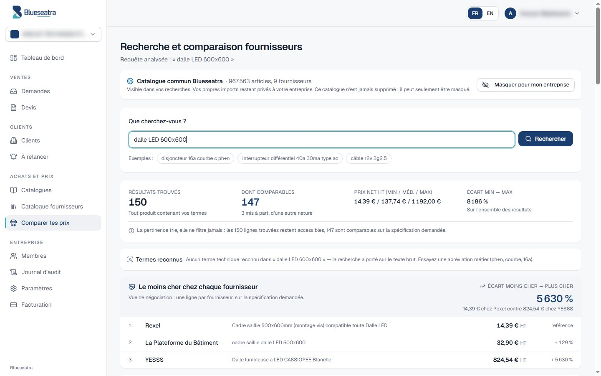

# Documentation Blueseatra

Toute la documentation du projet, classée par usage.

## Schémas

<table>
<tr>
<td width="50%" valign="top"> <b>Architecture</b> : Vercel, Render, Supabase, passerelle Hermès, VPS OVH</td>
<td width="50%" valign="top"> <b>Parcours complet d'un devis</b> : dix phases, qui agit et qui réagit</td>
</tr>
<tr>
<td width="50%" valign="top"> <b>Parcours d'une demande</b> : de l'e-mail au devis validé</td>
<td width="50%" valign="top"> <b>Routage IA</b> : passerelle Hermès, Ollama, Mistral, OpenCode Free</td>
</tr>
<tr>
<td width="50%" valign="top"> <b>Masquage RGPD</b> : marqueurs avant chaque appel IA, restauration côté serveur</td>
<td width="50%" valign="top"> <b>Suggestions d'articles G3</b> : candidats réels, choix de l'IA, validation humaine</td>
</tr>
<tr>
<td width="50%" valign="top"> <b>Chiffrage sur sources activables</b> : catalogue interne et catalogues fournisseurs</td>
<td width="50%" valign="top"> <b>Recherche fournisseurs sous RLS</b> : fonctions sécurisées, mesures avant et après</td>
</tr>
<tr>
<td width="50%" valign="top"> <b>Import de catalogue</b> : cinq étapes et verdict du contrôle</td>
<td width="50%" valign="top"> <b>Cycle de vie d'un devis</b> : statuts, relances, arrêt</td>
</tr>
<tr>
<td width="50%" valign="top"> <b>Relances par e-mail</b> : clic ou automatique, boîte de l'entreprise</td>
<td width="50%" valign="top"> <b>Quotas</b> : réservation, remboursement, ce qui n'est jamais compté</td>
</tr>
<tr>
<td width="50%" valign="top"> <b>Isolation des entreprises</b> : filtre du code et RLS PostgreSQL</td>
<td width="50%" valign="top"> <b>Droits RGPD</b> : export, anonymisation, opposition</td>
</tr>
<tr>
<td width="50%" valign="top"> <b>Chaîne de livraison</b> : PR, contrôles, déploiement, retour arrière</td>
<td width="50%" valign="top"> <b>Déroulé d'un incident</b> : détecter, contenir, corriger, vérifier</td>
</tr>
<tr>
<td width="50%" valign="top"> <b>Vue Supabase</b> : schéma blueseatra, rôles et RLS</td>
<td width="50%" valign="top"> <b>Vue Render</b> : services, variables, déploiement</td>
</tr>
</table>

Les schémas sont générés par [`scripts/docs/generer_schemas.py`](../scripts/docs/generer_schemas.py) et la bannière par [`scripts/docs/generer_banniere.py`](../scripts/docs/generer_banniere.py). Les schémas des dépôts Fournisseur-Blueseatra et ovh-ai-stack sont générés par [`scripts/docs/generer_schemas_ecosysteme.py`](../scripts/docs/generer_schemas_ecosysteme.py).

## Captures d'écran

<b>Les 31 écrans de l'application</b> (cliquer pour afficher)

<table>
<tr>
<td width="33%" valign="top"> <b>Tableau de bord</b></td>
<td width="33%" valign="top"> <b>Demandes</b></td>
<td width="33%" valign="top"> <b>Boîte de réception triée</b></td>
</tr>
<tr>
<td width="33%" valign="top"> <b>Demande lue par l'IA</b></td>
<td width="33%" valign="top"> <b>Lignes de travaux extraites</b></td>
<td width="33%" valign="top"> <b>Liste des devis</b></td>
</tr>
<tr>
<td width="33%" valign="top"> <b>Éditeur de devis</b></td>
<td width="33%" valign="top"> <b>Versions d'un devis</b></td>
<td width="33%" valign="top"> <b>PDF Pro Forma</b></td>
</tr>
<tr>
<td width="33%" valign="top"> <b>Catalogues</b></td>
<td width="33%" valign="top"> <b>Contrôle avant activation</b></td>
<td width="33%" valign="top"> <b>Catalogue d'un fournisseur</b></td>
</tr>
<tr>
<td width="33%" valign="top"> <b>Sources du chiffrage</b></td>
<td width="33%" valign="top"> <b>Catalogue fournisseurs</b></td>
<td width="33%" valign="top"> <b>Comparateur de prix</b></td>
</tr>
<tr>
<td width="33%" valign="top"> <b>Le moins cher par fournisseur</b></td>
<td width="33%" valign="top"> <b>Produits identiques</b></td>
<td width="33%" valign="top"> <b>Clients</b></td>
</tr>
<tr>
<td width="33%" valign="top"> <b>Fiche client</b></td>
<td width="33%" valign="top"> <b>À relancer</b></td>
<td width="33%" valign="top"> <b>Offre et consommation</b></td>
</tr>
<tr>
<td width="33%" valign="top"> <b>Membres et rôles</b></td>
<td width="33%" valign="top"> <b>Paramètres</b></td>
<td width="33%" valign="top"> <b>Société et PDF</b></td>
</tr>
<tr>
<td width="33%" valign="top"> <b>Données personnelles</b></td>
<td width="33%" valign="top"> <b>Journal d'audit</b></td>
<td width="33%" valign="top"> <b>Page d'accueil</b></td>
</tr>
<tr>
<td width="33%" valign="top"> <b>Offres</b></td>
<td width="33%" valign="top"> <b>Valeurs</b></td>
<td width="33%" valign="top"> <b>Connexion</b></td>
</tr>
<tr>
<td width="33%" valign="top"> <b>Configuration du moteur IA</b></td>
</tr>
</table>

## Utiliser

| Document | Contenu |
|---|---|
| [Manuel d'utilisation](./manuel-utilisateur.md) | Chaque écran, pas à pas, avec captures : demandes, devis, catalogues, clients, relances, membres, paramètres, offre |
| [Tarification](./tarification-2026-09.md) | Offres, quotas, règles multi-entreprises |
| [Contact et messagerie](./contact-blueseatra.md) | Adresse publique `contact@blueseatra.com`, motifs, boîtes Hostinger, DNS (SPF, DKIM, DMARC) |
| [Blueseatra_Documentation_FR.pdf](./Blueseatra_Documentation_FR.pdf) · [EN](./Blueseatra_Documentation_EN.pdf) | Présentation générale (PDF) |

## Comprendre

| Document | Contenu |
|---|---|
| [Architecture](./architecture.md) | Vue générale, parcours d'une demande, modules, modèle de données |
| [Infrastructure et parcours complet](./infrastructure.md) · [EN](./infrastructure.en.md) | Les dix phases d'un devis (qui agit, qui réagit), vues Supabase et Render, points d'attention |
| [Schéma de base de données](./schema-base-donnees.md) | Tables et colonnes du chiffrage et des devis, état au 01/10/2026 |
| [ADR : moteur IA sur OVH](./decisions/ADR-OVH-AI-STACK.md) | Pourquoi un moteur IA auto-hébergé |
| [ADR : cascade OCR](./decisions/ADR-OCR-CASCADE.md) | Choix et ordre des modèles de lecture |
| [ADR : file d'extraction séquentielle](./decisions/ADR-FILE-EXTRACTION-SEQUENTIELLE.md) | Une lecture à la fois, positions en file |
| [Spécification du module Clients](./specs/module-clients.md) | Tables, écrans, règles de relance, critères d'acceptation |
| [Cartographie](./Cartographie-Blueseatra-v2.pdf) · [Rapport d'architecture](./Blueseatra_Rapport_Jury_Architecture.pdf) | Documents de synthèse (PDF) |

## Développer

| Document | Contenu |
|---|---|
| [Guide développeur](./guide-developpeur.md) | Installation locale, variables, migrations, tests, dépannage |
| [Référence API](./reference-api.md) | Les 110 routes, générées depuis le code |
| [Contrat d'API fournisseurs](./contrat-api-fournisseurs.md) | Recherche et comparaison fournisseurs |
| [Intégration du module Fournisseur](./integration-module-fournisseur.md) | Lien avec le dépôt Fournisseur-Blueseatra |
| [Connecteur MCP](./MCP-PERPLEXITY.md) | Pont MCP vers Perplexity Computer |
| [Contribuer](../CONTRIBUTING.md) | Branches, commits, relecture |

## Exploiter

| Document | Contenu |
|---|---|
| [Exploitation](./exploitation.md) | Mise en production, supervision, quotas, retour arrière, sécurité |
| [DEPLOIEMENT.md](../DEPLOIEMENT.md) | Guide complet Vercel, Render, Supabase et VPS OVH |
| [Runbook DATABASE_URL_APP](./runbook-render-database-url-app.md) | Passage au rôle non propriétaire sur Render |
| [Checklist des secrets Render](../render-secrets-checklist.md) | Variables à renseigner à la main |
| [Audit d'isolation](./audit-isolation-tenants-2026-09-12.md) | Audit RLS du 12/09/2026 |
| [Runbook incident](./runbook-incident.md) | SLO, corrélation par `request_id`, déroulé, RACI, post-mortem |
| [Vocabulaire Rexel — passe de nuit](./vocabulaire-rexel-passe-nuit.md) | Remplissage par tranches des gros catalogues (747 771 offres) : procédure, seuils, constats `pg_stat_activity` |
| [Conformité RGPD](./conformite-rgpd.md) | Registre des traitements, droits des personnes, sous-traitants |
| [Masquage RGPD, OpenCode Free et G3](./rgpd-masquage-ia-externe.md) | Ce qui est masqué avant chaque appel IA, mesures sur données réelles, limites, OpenCode Free, chaîne G3, état en production |
| [SECURITY.md](../SECURITY.md) | Politique de sécurité et signalement |

## Historique

| Document | Contenu |
|---|---|
| [CHANGELOG](../CHANGELOG.md) | Changements PR par PR |
| [Mesures du rapprochement fournisseurs](./lot0-mesures-rapprochement-fournisseurs.md) | Mesures sur données réelles |
| [HANDOFF](../HANDOFF.md) · [Journal des actions](../JOURNAL-ACTIONS.md) | Optimisation de l'IA locale |
| [Guide d'import n8n](./Guide-import-n8n-P1.pdf) | Automatisations n8n (PDF) |
| [Skills de devis](./skills/devis-options-master/SKILL.md) · [Master prompt](./Skill_MASTER_agent_wWthone.md) · [Profil organisation](./Skill_PROFIL_organisation_wWthone.md) | Consignes des agents de chiffrage |

## Licence

Toute cette documentation, ses schémas et ses captures sont couverts par la licence propriétaire du dépôt : [LICENSE](../LICENSE). Titulaire : Zehair Louzza, exploitant le nom commercial « Blueseatra ».
