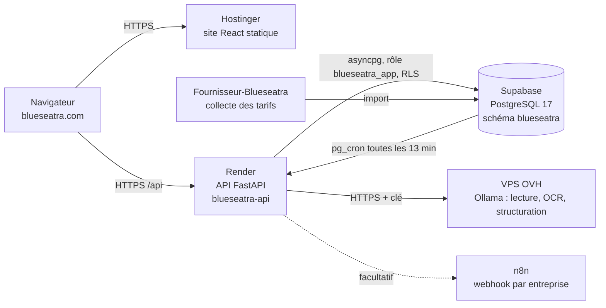
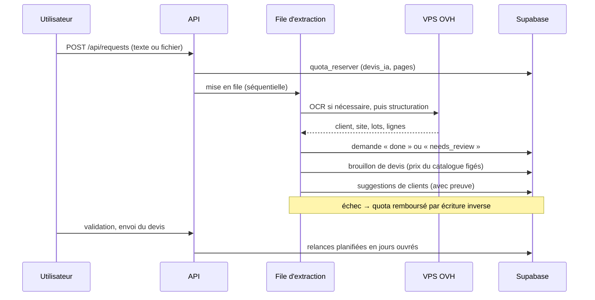
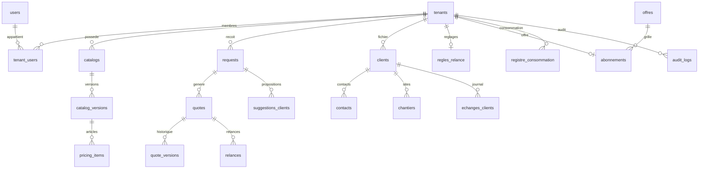

# Architecture

Vue d'ensemble technique de Blueseatra au 25/09/2026. Pour installer et tester, voir [`guide-developpeur.md`](./guide-developpeur.md).

## Vue générale

| Couche | Technologie | Hébergement |
|---|---|---|
| Site | React 18, React Router, Tailwind CSS, Radix/shadcn, react-i18next (FR/EN) | Hostinger, dépôt manuel du dossier `build/` |
| API | FastAPI, Python 3.11, Pydantic v2, SQLAlchemy 2 async, asyncpg | Render, Francfort, déploiement automatique depuis `main` (`backend/`) |
| Base | PostgreSQL 17, RLS, pg_cron | Supabase, projet `xmsxlochasjauhnxarvc` |
| IA | Ollama (Hermes, Qwen 2.5 VL, GLM…), repli configurable par entreprise via litellm | VPS OVH, dépôt [`ovh-ai-stack`](https://github.com/zehair-louzza/ovh-ai-stack) |
| PDF | ReportLab (Pro Forma) | API |
| Tarifs fournisseurs | Collecteurs et import volumineux | Dépôt [`Fournisseur-Blueseatra`](https://github.com/zehair-louzza/Fournisseur-Blueseatra) |

## Parcours d'une demande

## Principes non négociables

1. **L'IA ne fixe jamais un prix.** Elle lit et structure ; les prix viennent des catalogues, puis les remises, marges et TVA sont calculées par des règles (`matching.py`).
2. **Isolation des entreprises à deux niveaux.** Le code filtre `tenant_id`, et PostgreSQL l'impose par RLS sous le rôle `blueseatra_app`. Un identifiant d'une autre entreprise renvoie 404.
3. **Aucune suppression silencieuse.** Le catalogue commun est masquable mais jamais supprimé. Les clients sont archivés et les contacts anonymisés. Le registre de consommation et les échanges clients sont en ajout seul, protégés par un trigger.
4. **Validation humaine.** Un devis reste un brouillon tant qu'une personne ne l'a pas validé.

## Modules du backend

| Fichier | Rôle |
|---|---|
| `server.py` | Application FastAPI : authentification, entreprises, demandes, devis, catalogues, paramètres |
| `ai_service.py` | Lecture IA : cascade OCR, structuration en lots, rôles de modèles |
| `extraction_worker.py` | File d'extraction séquentielle |
| `matching.py` | Rapprochement des lignes avec le catalogue, calcul des totaux |
| `quote_scenarios.py` | Options et variantes de devis |
| `pdf_service.py` | PDF Pro Forma |
| `catalogue_commun.py`, `catalogue_navigation.py`, `fournisseur_recherche.py` | Catalogue fournisseurs commun et comparateur |
| `quotas.py` | Offres, registre de consommation, réservation et remboursement |
| `clients_module.py`, `relances_regles.py` | Module Clients et règles de relance |
| `pg_adapter.py`, `database.py`, `models_sql.py` | Accès PostgreSQL et session par entreprise |
| `mcp_bridge.py` | Pont MCP (`/mcp`) |

## Modèle de données

Autres tables : `import_jobs`, `import_errors`, `settings_integrations` (clé IA chiffrée Fernet), `company_profiles` et les tables du catalogue fournisseurs : `suppliers`, `supplier_offers`, `canonical_products`, `product_match_rules`, `unit_conversions`, `tenant_catalogue_commun` et `catalogue_commun_masque`.

## Décisions d'architecture

- [`decisions/ADR-OVH-AI-STACK.md`](./decisions/ADR-OVH-AI-STACK.md) : moteur IA auto-hébergé sur OVH
- [`decisions/ADR-OCR-CASCADE.md`](./decisions/ADR-OCR-CASCADE.md) : cascade OCR
- [`decisions/ADR-FILE-EXTRACTION-SEQUENTIELLE.md`](./decisions/ADR-FILE-EXTRACTION-SEQUENTIELLE.md) : file d'extraction séquentielle
- [`specs/module-clients.md`](./specs/module-clients.md) : spécification du module Clients
