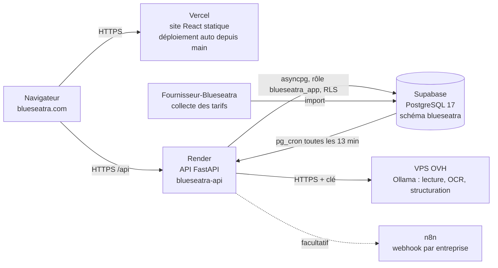
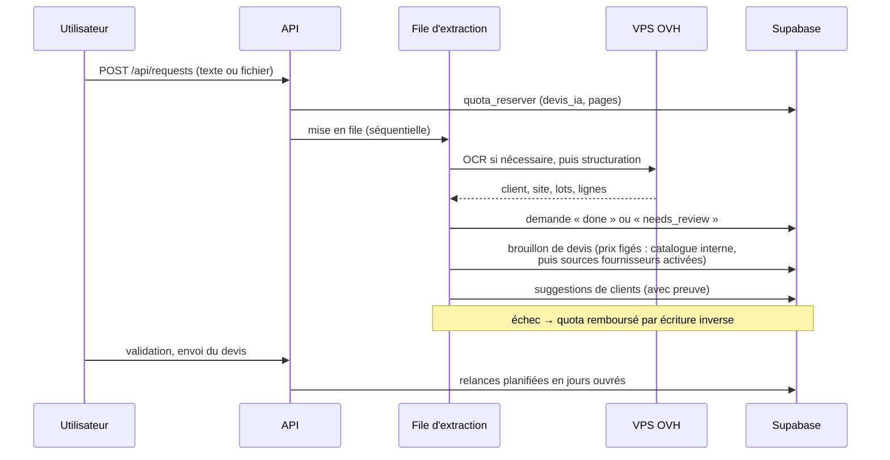
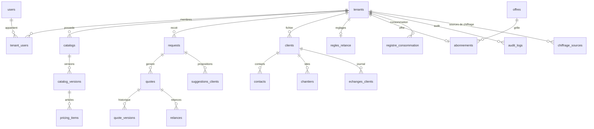

# Architecture

Vue d'ensemble technique de Blueseatra au 01/10/2026. Pour installer et tester, voir [`guide-developpeur.md`](./guide-developpeur.md).

## Vue générale

La même vue en texte (Mermaid) :

| Couche | Technologie | Hébergement |
|---|---|---|
| Site | React 18, React Router, Tailwind CSS, Radix/shadcn, react-i18next (FR/EN) | Vercel, déploiement automatique depuis `main` (`frontend/`), domaine blueseatra.com |
| API | FastAPI, Python 3.11, Pydantic v2, SQLAlchemy 2 async, asyncpg | Render, Francfort, déploiement automatique depuis `main` (`backend/`) |
| Base | PostgreSQL 17, RLS, pg_cron | Supabase, projet `xmsxlochasjauhnxarvc` |
| IA | Ollama (Hermes, Qwen 2.5 VL, GLM…), repli configurable par entreprise via litellm | VPS OVH, dépôt [`ovh-ai-stack`](https://github.com/zehair-louzza/ovh-ai-stack) |
| PDF | ReportLab (Pro Forma) | API |
| Tarifs fournisseurs | Collecteurs et import volumineux | Dépôt [`Fournisseur-Blueseatra`](https://github.com/zehair-louzza/Fournisseur-Blueseatra) |

## Parcours d'une demande

## Routage IA

Depuis le 9 octobre 2026, **chaque appel IA est masqué**, qu'il vise un modèle local du VPS (`custom:ollama`), Mistral (`custom:mistral`) ou OpenCode Free (`opencode-free`) :

- **Avant l'envoi** : `masquage_rgpd.py` remplace les adresses, noms de sites, clients, donneurs d'ordre, personnes et identifiants par des marqueurs.
- **Après la réponse** : `ai_service` remet les vraies valeurs, sur le serveur.
- **Images** : elles ne quittent jamais le VPS.

Le fournisseur choisi dans les réglages devient un paramètre `provider` envoyé à la passerelle :

| Réglage | Envoyé à la passerelle |
|---|---|
| Moteur intégré | `custom:ollama` |
| Mistral | `custom:mistral` (préfixe interne `mistral:`) |
| OpenCode Free | `opencode-free` (préfixe interne `opencode:`) |

La file d'attente du VPS (`OLLAMA_MAX_CONCURRENCY`, une place par défaut) ne concerne que les modèles locaux. Un appel externe ne l'occupe pas et ne l'attend pas.

**Suggestions G3** : depuis la page d'une demande, `POST /api/requests/{id}/suggestions-g3` (`recherche_g3.py`) enchaîne les étapes suivantes. Elles sont activées par `BLUESEATRA_G3=1`.

1. Extraction des fournitures par l'IA.
2. Recherche de 20 candidats dans le catalogue actif (recherche par mots et BM25).
3. Choix de l'IA parmi ces candidats.
4. Résultat toujours « à valider ».

Détails : [rgpd-masquage-ia-externe.md](./rgpd-masquage-ia-externe.md).

## Chiffrage sur sources activables

## Recherche fournisseurs sous RLS

Sous le rôle `blueseatra_app`, la RLS empêchait PostgreSQL d'utiliser l'index trigramme de `supplier_offers` : `LIKE` n'est pas « leakproof », il ne peut donc pas être évalué avant les politiques, et chaque recherche lisait les offres ligne à ligne (27 s au comparateur, plus de 30 s au sélecteur du devis). Trois fonctions `SECURITY DEFINER` font désormais la recherche à la place de l'application. Elles refusent tout tenant autre que l'entreprise courante ou le catalogue commun et ne renvoient que des identifiants ; les fiches sont ensuite relues **sous RLS**, avec le filtre `tenant_id` explicite.

| Fonction | Utilisée par | Migration |
|---|---|---|
| `offres_candidates` | comparateur de prix (filtre famille facultatif), sélecteur d'articles du devis, génération | `20261001180000`, `20261001200000` |
| `catalogue_page` | recherche par mot dans un catalogue (« Afficher le catalogue ») | `20261001190000` |
| `familles_catalogue` | menu Famille du comparateur (parcours en saut de l'index des familles) | `20261001210000` |
| `recherche_conditions` | règles des motifs partagées (interne, non appelable par l'application) | `20261001190000` |

Les motifs sont injectés en littéraux échappés (`format %L`), les limites de mot du vocabulaire passent de `\b` (Python) à `\y` (PostgreSQL), et chaque fonction est couverte par des tests sur base jetable avec les vraies politiques RLS (`backend/tests_security/test_offres_candidates_sql.py`).

## Principes non négociables

1. **L'IA ne fixe jamais un prix.** Elle lit et structure ; les prix viennent du catalogue interne ou des catalogues fournisseurs **activés par l'entreprise pour le chiffrage** (boutons poussoirs, table `chiffrage_sources`), puis les remises, marges et TVA sont calculées par des règles (`matching.py`). Sans catalogue interne, les sources fournisseurs activées prennent le relais ; sans aucune des deux, la génération refuse avec un message explicite — mais jamais à cause d'offres simplement introuvables (le devis est produit, lignes à confirmer).
2. **Isolation des entreprises à deux niveaux.** Le code filtre `tenant_id`, et PostgreSQL l'impose par RLS sous le rôle `blueseatra_app`. Un identifiant d'une autre entreprise renvoie 404. Les trois fonctions de recherche `SECURITY DEFINER` (ci-dessus) vérifient elles-mêmes le tenant et ne renvoient que des identifiants, relus sous RLS.
3. **Aucune suppression silencieuse.** Le catalogue commun est masquable mais jamais supprimé. Les clients sont archivés et les contacts anonymisés. Le registre de consommation et les échanges clients sont en ajout seul, protégés par un trigger.
4. **Validation humaine.** Un devis reste un brouillon tant qu'une personne ne l'a pas validé.

## Isolation des entreprises

## Chaîne de livraison

## Modules du backend

| Fichier | Rôle |
|---|---|
| `server.py` | Application FastAPI : authentification, entreprises, demandes, devis, catalogues, paramètres |
| `ai_service.py` | Lecture IA : cascade OCR, structuration en lots, rôles de modèles |
| `extraction_worker.py` | File d'extraction séquentielle |
| `matching.py` | Rapprochement des lignes avec le catalogue, calcul des totaux |
| `quote_scenarios.py` | Options et variantes de devis |
| `pdf_service.py` | PDF Pro Forma |
| `catalogue_commun.py`, `catalogue_navigation.py`, `fournisseur_recherche.py`, `catalogue_chiffrage.py` | Catalogue fournisseurs commun, comparateur, sources de chiffrage activables |
| `quotas.py` | Offres, registre de consommation, réservation et remboursement |
| `clients_module.py`, `relances_regles.py` | Module Clients et règles de relance |
| `pg_adapter.py`, `database.py`, `models_sql.py` | Accès PostgreSQL et session par entreprise |
| `mcp_bridge.py` | Pont MCP (`/mcp`) |

## Modèle de données

Autres tables : `import_jobs`, `import_errors`, `settings_integrations` (clé IA chiffrée Fernet), `company_profiles` et les tables du catalogue fournisseurs : `suppliers`, `supplier_offers`, `canonical_products`, `product_match_rules`, `unit_conversions`, `tenant_catalogue_commun` et `catalogue_commun_masque`. Détail des colonnes : [`schema-base-donnees.md`](./schema-base-donnees.md).

## Décisions d'architecture

- [`decisions/ADR-OVH-AI-STACK.md`](./decisions/ADR-OVH-AI-STACK.md) : moteur IA auto-hébergé sur OVH
- [`decisions/ADR-OCR-CASCADE.md`](./decisions/ADR-OCR-CASCADE.md) : cascade OCR
- [`decisions/ADR-FILE-EXTRACTION-SEQUENTIELLE.md`](./decisions/ADR-FILE-EXTRACTION-SEQUENTIELLE.md) : file d'extraction séquentielle
- [`specs/module-clients.md`](./specs/module-clients.md) : spécification du module Clients
