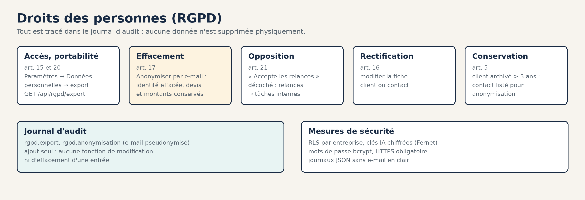
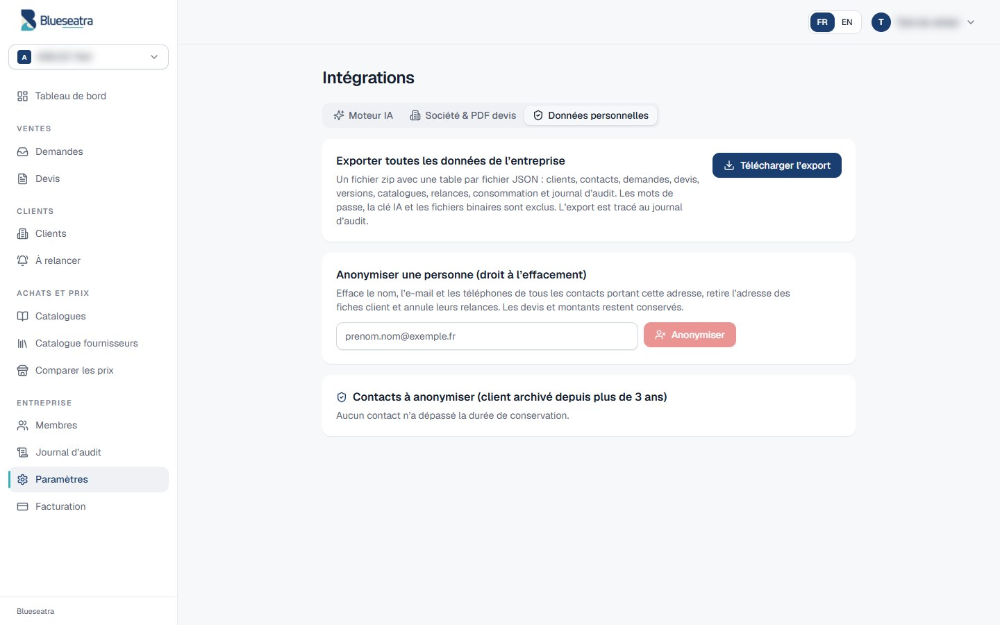

# Conformité RGPD

État au 25/09/2026. **Ce document sert de base de travail : il doit être relu par un juriste avant toute publication commerciale.**

## Rôles

| Rôle | Qui | Pourquoi |
|---|---|---|
| **Responsable de traitement** | Chaque entreprise cliente | Elle décide des données de ses clients, contacts et chantiers |
| **Sous-traitant** (art. 28) | Blueseatra | Il héberge et traite ces données pour le compte de l'entreprise |
| **Responsable de traitement** | Blueseatra | Pour ses propres traitements : comptes utilisateurs, facturation SaaS, support |

## Registre des traitements

| # | Traitement | Personnes | Données | Finalité | Base légale | Conservation |
|---|---|---|---|---|---|---|
| T1 | Comptes utilisateurs | Membres des entreprises | Nom, e-mail, empreinte du mot de passe (bcrypt), rôle | Accès au service | Contrat | Durée du compte, puis 1 an |
| T2 | Fichier clients | Contacts des clients | Nom, fonction, e-mail, téléphones, langue, accord pour les relances | Devis et suivi commercial | Intérêt légitime de l'entreprise | 3 ans après l'archivage du client, puis anonymisation |
| T3 | Demandes et devis | Donneurs d'ordre, clients finaux | Coordonnées présentes dans les documents, adresses de chantier | Chiffrage | Contrat ou mesures précontractuelles | 10 ans (pièces commerciales), sans données inutiles |
| T4 | Relances | Contacts | E-mail, téléphone, historique des relances | Suivi des devis | Intérêt légitime, avec opposition possible | Comme T2 |
| T5 | Lecture IA | Personnes citées dans les documents | Texte et images des documents | Extraction des besoins | Contrat | PDF et documents bureautiques : le fichier n'est pas conservé, seuls le texte extrait et le résultat structuré le sont. **Photos : conservées dans la demande** (`requests.file_b64`) pour l'analyse approfondie, jusqu'à la suppression de la demande |
| T6 | Consommation et facturation | Entreprises | Registre de consommation, offre | Facturation | Contrat, obligation légale | 10 ans (pièces comptables) |
| T7 | Journal d'audit | Membres | E-mail de l'auteur, action, date | Sécurité et traçabilité | Intérêt légitime | 1 an glissant (purge à mettre en place) |
| T8 | Journaux techniques | Utilisateurs | Identifiant de requête, route, statut, durée ; e-mails pseudonymisés | Exploitation | Intérêt légitime | Durée de rétention de Render |

## Sous-traitants ultérieurs

| Service | Rôle | Localisation |
|---|---|---|
| Supabase | Base PostgreSQL | Région du projet (à confirmer dans la console) |
| Render | Hébergement de l'API | Francfort (UE) |
| Vercel | Hébergement du site statique et CDN | CDN mondial, siège américain — cadre de transfert hors UE à vérifier contractuellement (Standard Contractual Clauses) |
| OVH | Moteur IA auto-hébergé | Datacenter du VPS (à confirmer dans l'espace client OVH) |
| Stripe (à venir, #90) | Paiement | UE et États-Unis, clauses contractuelles types |

## Droits des personnes

| Droit | Comment l'exercer dans Blueseatra | Traçabilité |
|---|---|---|
| **Accès et portabilité** (art. 15 et 20) | **Paramètres → Données personnelles → Télécharger l'export**, ou `GET /api/rgpd/export` | `audit_logs` : `rgpd.export` |
| **Effacement** (art. 17) | **Paramètres → Données personnelles → Anonymiser**, ou `POST /api/rgpd/personnes/anonymiser` avec l'e-mail de la personne | `audit_logs` : `rgpd.anonymisation`, e-mail pseudonymisé |
| **Opposition aux relances** (art. 21) | Fiche contact : décocher « Accepte les relances » | Relances converties en tâches internes |
| **Rectification** (art. 16) | Modifier la fiche client ou contact | `audit_logs` |
| **Conservation limitée** (art. 5) | `GET /api/rgpd/echeances` et l'onglet Données personnelles listent les contacts dont le client est archivé depuis plus de 3 ans | — |

L'anonymisation efface l'identité mais conserve les devis et les montants, qui restent des pièces commerciales. Aucune donnée n'est supprimée physiquement par l'application.

## Mesures de sécurité

- **Isolation :** RLS PostgreSQL par entreprise sous le rôle `blueseatra_app`, filtre `tenant_id` explicite vérifié en CI, y compris sur le SQL écrit à la main.
- **Secrets :** clés IA chiffrées (Fernet), mots de passe hachés avec bcrypt, jetons JWT signés.
- **Journaux :** au format JSON, sans e-mail en clair (empreinte à la place) ; entreprise pseudonymisée.
- **Transport :** HTTPS obligatoire.
- **Export :** les mots de passe, la clé IA et les fichiers binaires en sont exclus.

## Reste à faire

- [ ] Faire valider ce registre et rédiger le DPA (accord de sous-traitance), les CGV et les mentions légales avec un juriste.
- [ ] Mettre en place la purge du journal d'audit au-delà d'un an (tâche planifiée, après validation).
- [ ] Confirmer la région Supabase et le datacenter OVH, puis les inscrire ci-dessus.
- [ ] Fixer une durée de conservation des photos de demandes (`file_b64`), par exemple 12 mois.
