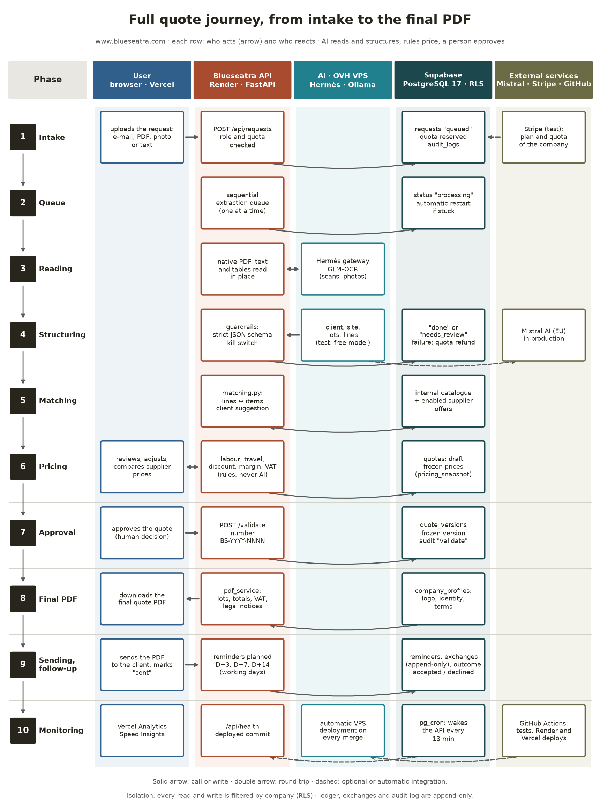
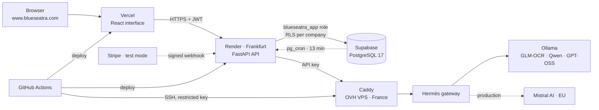
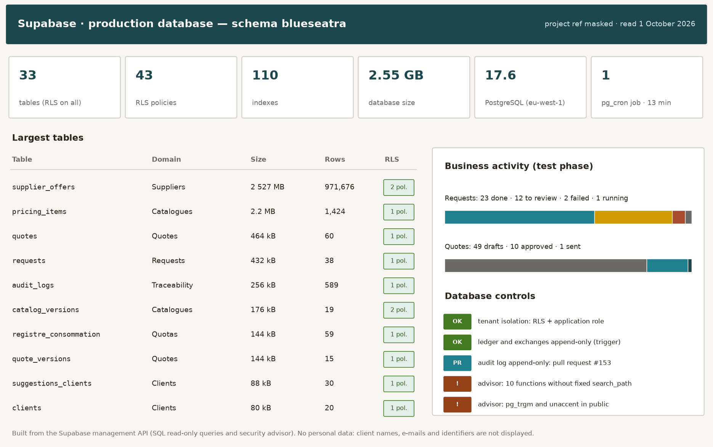
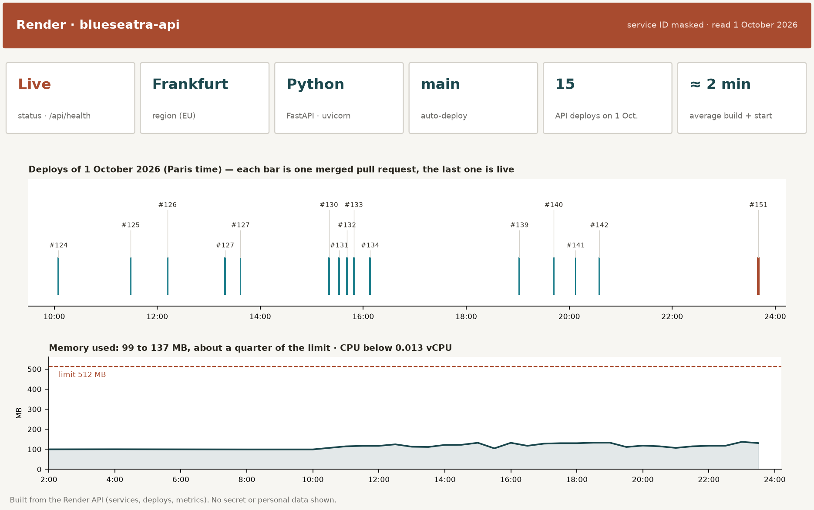

# Infrastructure and full quote journey

> **Live application: [www.blueseatra.com](https://www.blueseatra.com)** · [Version française](./infrastructure.md)

This document shows, from the intake of a request to the final quote PDF, **which integration acts and which one reacts**, then the real state of the two hosting platforms: Supabase (database) and Render (API). The views were built on 1 October 2026 from the APIs of both services. **No personal data appears**: client names, e-mails, project and service identifiers are masked.

## Contents

1. [Full quote journey](#1-full-quote-journey)
2. [Infrastructure map](#2-infrastructure-map)
3. [Supabase: the production database](#3-supabase-the-production-database)
4. [Render: the production API](#4-render-the-production-api)
5. [Points of attention](#5-points-of-attention)

## 1. Full quote journey

| # | Phase | Acts | Reacts |
|---|---|---|---|
| 1 | Intake | The user uploads an e-mail, a PDF, a photo or a text on www.blueseatra.com (React interface hosted on Vercel) | `POST /api/requests` (Render) checks role and quota; Supabase stores the request, reserves the quota (`registre_consommation`) and logs the action (`audit_logs`) |
| 2 | Queue | The API extraction queue processes **one request at a time** | Supabase sets the request to `processing`; a stuck request is restarted automatically |
| 3 | Reading | The API reads the text and tables of a native PDF in place | For a scan or a photo, the Hermès gateway on the OVH VPS calls the local GLM-OCR model (Ollama) |
| 4 | Structuring | The structuring model extracts client, site, lots and lines (test phase: free model on CPU; production: Mistral AI) | The API applies the guardrails (strict JSON schema, kill switch); Supabase stores `done` or `needs_review` and refunds the quota on failure |
| 5 | Matching | `matching.py` matches each line with an item | Supabase provides the internal catalogue and the supplier offers **enabled by the company** (`chiffrage_sources`, search functions under RLS); a client suggestion is proposed with its evidence |
| 6 | Pricing | API rules compute labour, travel, discount, margin and VAT — **never the AI** | Supabase stores the draft (`quotes`) with frozen prices; the user reviews, adjusts and compares prices |
| 7 | Approval | The user approves (human decision) | `POST /quotes/{id}/validate` freezes a version (`quote_versions`), numbered `BS-YYYY-NNNN`, and logs the action |
| 8 | Final PDF | `GET /quotes/{id}/pdf`: `pdf_service.py` lays out lots, totals, VAT and legal notices | Supabase provides the company identity (`company_profiles`); the user downloads the final quote PDF |
| 9 | Sending, follow-up | The user sends the PDF and marks the quote "sent" | The API plans reminders on working days (D+3, D+7, D+14); Supabase keeps reminders, exchanges (append-only) and the quote outcome |
| 10 | Monitoring | GitHub Actions tests every pull request and deploys Render, Vercel and the VPS | `pg_cron` wakes the API every 13 minutes; `/api/health` exposes the deployed commit; Vercel Analytics and Speed Insights measure audience and performance |

## 2. Infrastructure map

| Platform | Role | Region |
|---|---|---|
| Vercel | React interface, audience and performance measurement | global network |
| Render | FastAPI API, extraction queue, PDF generation | Frankfurt (EU) |
| Supabase | PostgreSQL 17: 33 tables, RLS on all, 43 policies, 110 indexes | eu-west-1 (EU) |
| OVHcloud | VPS: Caddy, Hermès gateway and agent, Ollama, n8n | France |
| Mistral AI | Production models (switch planned after the test phase) | EU |
| Stripe | Subscriptions and top-ups, test mode | — |
| GitHub | Code, reviews, tests and automatic deployments | — |

## 3. Supabase: the production database

- **Volume**: 2.55 GB, of which 2.53 GB for the 971,676 supplier catalogue offers (`supplier_offers`).
- **Isolation**: RLS enabled on all 33 tables; the API connects with the `blueseatra_app` role, which only sees the current company.
- **Test activity**: 38 requests (23 read, 12 to review, 2 failed, 1 running) and 60 quotes (49 drafts, 10 approved, 1 sent).
- **Append-only**: usage ledger and client exchanges protected by trigger; audit log protection in progress (pull request [#153](https://github.com/zehair-louzza/Blueseatra/pull/153)).

Tables and relations are detailed in the [database schema](./schema-base-donnees.md) (French).

## 4. Render: the production API

- **Service**: `blueseatra-api`, Python (FastAPI, uvicorn), Frankfurt region, health check `/api/health`.
- **Continuous delivery**: every merge into `main` triggers an automatic deploy; 15 deploys on 1 October 2026, about 2 minutes each.
- **Resources**: 99 to 137 MB of memory used out of 512 MB, CPU below 0.013 vCPU over the day.
- **Previews**: every API pull request gets a temporary preview service.

## 5. Points of attention

| Point | Status | Next step |
|---|---|---|
| Append-only audit log | Pull request [#153](https://github.com/zehair-louzza/Blueseatra/pull/153) | Merge, then apply migration `20261001230000` on Supabase |
| Supabase advisor: 10 functions without fixed `search_path` | Warning | Add `SET search_path = ''` to these functions |
| Supabase advisor: `pg_trgm` and `unaccent` in `public` | Warning | Move the extensions to a dedicated schema, after testing the indexes |
| Free Render instance | Sleep offset by `pg_cron` | Move to a paid instance before going commercial |
