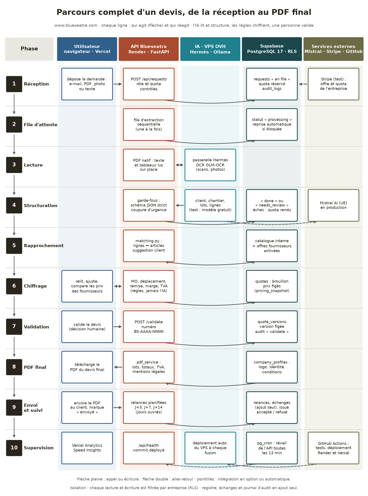
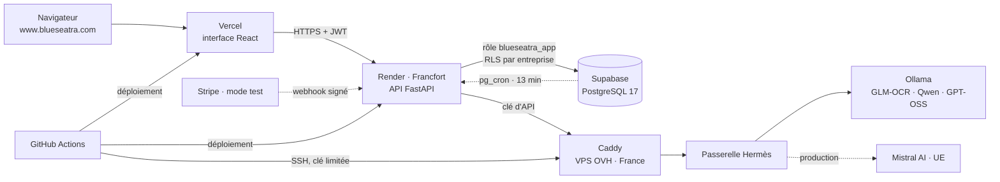
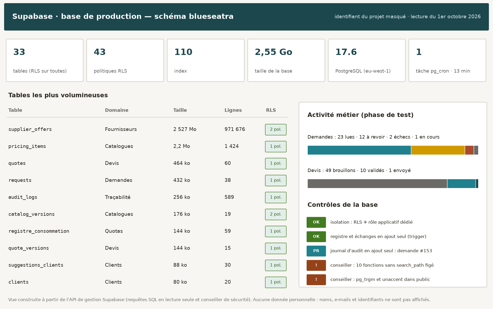
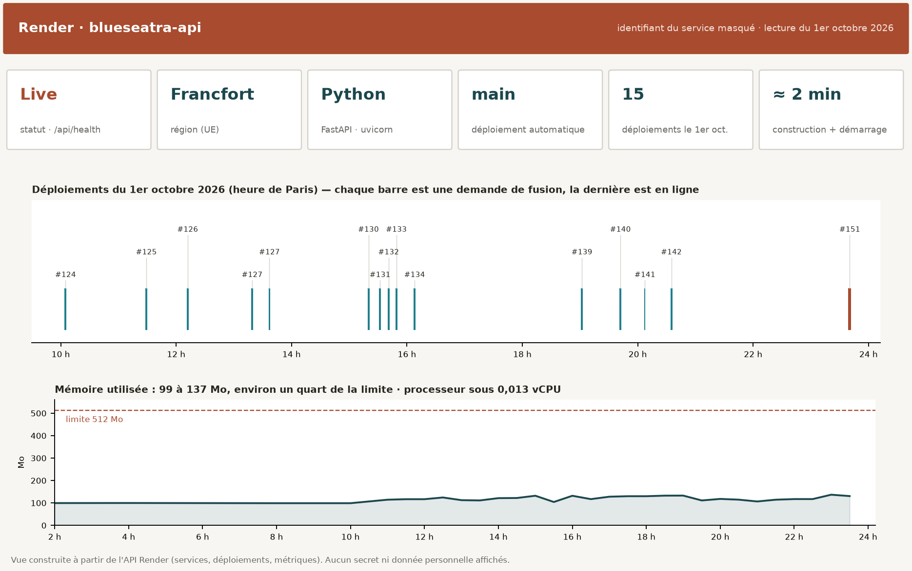

# Infrastructure et parcours complet d'un devis

> **Application en ligne : [www.blueseatra.com](https://www.blueseatra.com)** · [English version](./infrastructure.en.md)

Ce document montre, de la réception d'une demande jusqu'au PDF du devis final, **quelle intégration agit et laquelle réagit**, puis l'état réel des deux plateformes d'hébergement : Supabase (base de données) et Render (API). Les vues ont été construites le 1er octobre 2026 à partir des API des deux services. **Aucune donnée personnelle n'y figure** : noms de clients, e-mails, identifiants de projet et de service sont masqués.

## Sommaire

1. [Parcours complet d'un devis](#1-parcours-complet-dun-devis)
2. [Carte de l'infrastructure](#2-carte-de-linfrastructure)
3. [Supabase : la base de production](#3-supabase--la-base-de-production)
4. [Render : l'API en production](#4-render--lapi-en-production)
5. [Points d'attention](#5-points-dattention)

## 1. Parcours complet d'un devis

| # | Phase | Agit | Réagit |
|---|---|---|---|
| 1 | Réception | L'utilisateur dépose un e-mail, un PDF, une photo ou un texte sur www.blueseatra.com (interface React hébergée sur Vercel) | `POST /api/requests` (Render) contrôle le rôle et le quota ; Supabase enregistre la demande, réserve le quota (`registre_consommation`) et trace l'action (`audit_logs`) |
| 2 | File d'attente | La file d'extraction de l'API traite **une demande à la fois** | Supabase passe la demande en `processing` ; une demande bloquée est reprise automatiquement |
| 3 | Lecture | L'API lit sur place le texte et les tableaux d'un PDF natif | Pour un scan ou une photo, la passerelle Hermès du VPS OVH appelle l'OCR local GLM-OCR (Ollama) |
| 4 | Structuration | Le modèle de structuration extrait client, chantier, lots et lignes (phase de test : modèle gratuit sur processeur ; production : Mistral AI) | L'API applique les garde-fous (schéma JSON strict, coupure d'urgence) ; Supabase enregistre `done` ou `needs_review`, et rembourse le quota en cas d'échec |
| 5 | Rapprochement | `matching.py` rapproche chaque ligne d'un article | Supabase fournit le catalogue interne et les offres fournisseurs **activées par l'entreprise** (`chiffrage_sources`, fonctions de recherche sous RLS) ; une suggestion de client est proposée avec sa preuve |
| 6 | Chiffrage | Les règles de l'API calculent main-d'œuvre, déplacement, remise, marge et TVA — **jamais l'IA** | Supabase enregistre le brouillon (`quotes`) avec ses prix figés ; l'utilisateur relit, ajuste et compare les prix |
| 7 | Validation | L'utilisateur valide (décision humaine) | `POST /quotes/{id}/validate` fige une version (`quote_versions`), numérotée `BS-AAAA-NNNN`, et trace l'action |
| 8 | PDF final | `GET /quotes/{id}/pdf` : `pdf_service.py` met en page lots, totaux, TVA et mentions légales | Supabase fournit l'identité de l'entreprise (`company_profiles`) ; l'utilisateur télécharge le PDF du devis final |
| 9 | Envoi et suivi | L'utilisateur envoie le PDF et marque le devis « envoyé » | L'API planifie les relances en jours ouvrés (J+3, J+7, J+14) ; Supabase conserve relances, échanges (ajout seul) et issue du devis |
| 10 | Supervision | GitHub Actions teste chaque demande de fusion et déploie Render, Vercel et le VPS | `pg_cron` réveille l'API toutes les 13 minutes ; `/api/health` expose le commit déployé ; Vercel Analytics et Speed Insights mesurent l'audience et la performance |

## 2. Carte de l'infrastructure

| Plateforme | Rôle | Région |
|---|---|---|
| Vercel | Interface React, mesure d'audience et de performance | réseau mondial |
| Render | API FastAPI, file d'extraction, génération du PDF | Francfort (UE) |
| Supabase | PostgreSQL 17 : 33 tables, RLS sur toutes, 43 politiques, 110 index | eu-west-1 (UE) |
| OVHcloud | VPS : Caddy, passerelle et agent Hermès, Ollama, n8n | France |
| Mistral AI | Modèles en production (bascule prévue après la phase de test) | UE |
| Stripe | Abonnements et recharges, en mode test | — |
| GitHub | Code, revues, tests et déploiements automatiques | — |

## 3. Supabase : la base de production

- **Volume** : 2,55 Go, dont 2,53 Go pour les 971 676 offres des catalogues fournisseurs (`supplier_offers`).
- **Isolation** : RLS activée sur les 33 tables ; l'API se connecte sous le rôle `blueseatra_app`, qui ne voit que l'entreprise courante.
- **Activité de test** : 38 demandes (23 lues, 12 à revoir, 2 échecs, 1 en cours) et 60 devis (49 brouillons, 10 validés, 1 envoyé).
- **Ajout seul** : registre de consommation, échanges clients et journal d'audit protégés par trigger. Pour `audit_logs`, la migration `20261010030000` ([#153](https://github.com/zehair-louzza/Blueseatra/pull/153)) est appliquée en production depuis le 10/10/2026 : le rôle applicatif et `authenticated` n'ont plus que `SELECT` et `INSERT`, et toute modification, suppression ou vidage est refusé.

Le détail des tables et des relations est dans le [schéma de la base de données](./schema-base-donnees.md).

## 4. Render : l'API en production

- **Service** : `blueseatra-api`, Python (FastAPI, uvicorn), région Francfort, contrôle de santé `/api/health`.
- **Livraison continue** : chaque fusion dans `main` déclenche un déploiement automatique ; 15 déploiements le 1er octobre 2026, environ 2 minutes chacun.
- **Ressources** : 99 à 137 Mo de mémoire utilisés sur 512 Mo, processeur sous 0,013 vCPU sur la journée.
- **Aperçus** : chaque demande de fusion de l'API obtient un service d'aperçu temporaire.

## 5. Points d'attention

| Point | État | Suite |
|---|---|---|
| Journal d'audit en ajout seul | Fait le 10/10/2026 : [#153](https://github.com/zehair-louzza/Blueseatra/pull/153) fusionnée, migration `20261010030000` appliquée sur Supabase. Vérifié : ajout accepté ; modification, suppression et vidage refusés | Aucune |
| Conseiller Supabase : 10 fonctions sans `search_path` figé | Avertissement | Ajouter `SET search_path = ''` aux fonctions concernées |
| Conseiller Supabase : `pg_trgm` et `unaccent` dans `public` | Avertissement | Déplacer les extensions dans un schéma dédié, après test des index |
| Instance Render gratuite | Mise en veille compensée par `pg_cron` | Passer à une instance payante avant la commercialisation |
