# Manuel d'utilisation de Blueseatra

> Version du 25/09/2026, application en ligne sur [blueseatra.com](https://blueseatra.com).
> Ce manuel décrit l'application telle qu'elle fonctionne aujourd'hui, écran par écran. Les captures ont été réalisées avec des données fictives.

## Sommaire

1. [Principe en une minute](#1-principe-en-une-minute)
2. [Créer un compte et se connecter](#2-créer-un-compte-et-se-connecter)
3. [Se repérer dans l'application](#3-se-repérer-dans-lapplication)
4. [Tableau de bord](#4-tableau-de-bord)
5. [Demandes : faire lire un document par l'IA](#5-demandes--faire-lire-un-document-par-lia)
6. [Devis : vérifier, ajuster, valider, envoyer](#6-devis--vérifier-ajuster-valider-envoyer)
7. [Catalogues sur mesure](#7-catalogues-sur-mesure)
8. [Catalogue fournisseurs et comparateur de prix](#8-catalogue-fournisseurs-et-comparateur-de-prix)
9. [Clients](#9-clients)
10. [À relancer](#10-à-relancer)
11. [Membres et rôles](#11-membres-et-rôles)
12. [Paramètres](#12-paramètres)
13. [Offre et consommation](#13-offre-et-consommation)
14. [Journal d'audit](#14-journal-daudit)
15. [Questions fréquentes](#15-questions-fréquentes)

---

## 1. Principe en une minute

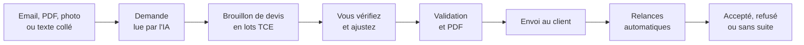

- **L'IA lit et structure.** Elle repère le client, le site, l'objet et les lignes de travaux.
- **Les prix viennent de vos catalogues**, jamais de l'IA. Les remises, marges et la TVA sont calculées par des règles fixes.
- **Rien ne part sans vous.** Un devis reste un brouillon tant que vous ne l'avez pas validé.
- **Rien n'est supprimé en silence.** Les clients sont archivés, les relances annulées avec leur motif, et chaque action sensible est enregistrée au journal d'audit.

## 2. Créer un compte et se connecter

1. Sur [blueseatra.com](https://blueseatra.com), cliquez sur **Essai gratuit** ou **Se connecter**.
2. À l'inscription, indiquez votre nom, votre adresse e-mail, un mot de passe et le nom de votre entreprise. Un espace entreprise est créé, et vous en êtes le propriétaire.
3. L'essai **Découverte** dure 14 jours, sans carte bancaire.
4. Si vous appartenez à plusieurs entreprises, choisissez l'espace actif avec le **sélecteur d'entreprise**, en haut à gauche. Chaque entreprise ne voit que ses propres données.

## 3. Se repérer dans l'application

Le menu de gauche regroupe les écrans par usage :

| Groupe | Écrans |
|---|---|
| **Ventes** | Demandes, Devis |
| **Clients** | Clients, À relancer (un badge indique le nombre de relances du jour) |
| **Achats et prix** | Catalogues, Catalogue fournisseurs, Comparer les prix |
| **Entreprise** | Membres, Journal d'audit, Paramètres, Facturation |

En haut à droite : le choix de la langue (**FR** ou **EN**) et votre menu personnel (profil, déconnexion). Le mot de passe d'un membre se change depuis **Membres**, par le propriétaire.

## 4. Tableau de bord

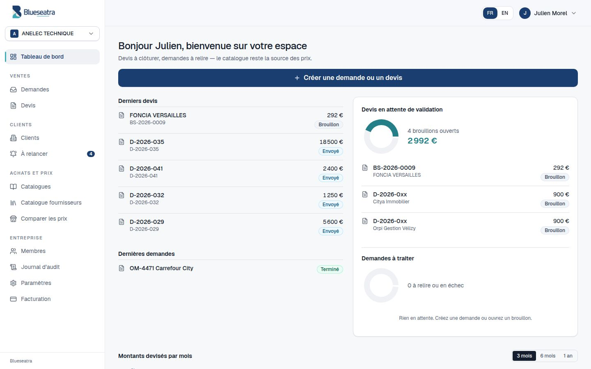

- **Créer une demande ou un devis** : le bouton principal ouvre directement la création.
- **Derniers devis** et **Dernières demandes** : un clic ouvre l'élément.
- **Devis en attente de validation** : le nombre de brouillons ouverts et leur montant total.
- **Demandes à traiter** : les demandes à relire ou dont la lecture a échoué.
- **Montants devisés par mois** : l'évolution sur 3 mois, 6 mois ou 1 an.

## 5. Demandes : faire lire un document par l'IA

### Créer une demande

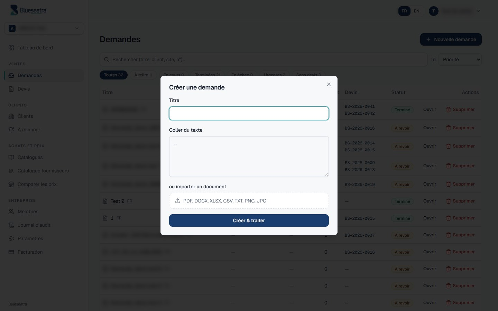

1. Ouvrez **Demandes**, puis cliquez sur **Nouvelle demande**.
2. Donnez un titre, par exemple le numéro d'ordre de mission.
3. Collez le texte de l'e-mail, **ou** importez un document : PDF, DOCX, XLSX, CSV, TXT, PNG ou JPG.
4. Cliquez sur **Créer & traiter**.

Les demandes sont lues l'une après l'autre. Quand plusieurs sont en cours, la liste affiche leur position dans la file.

### Trier et filtrer la boîte de réception

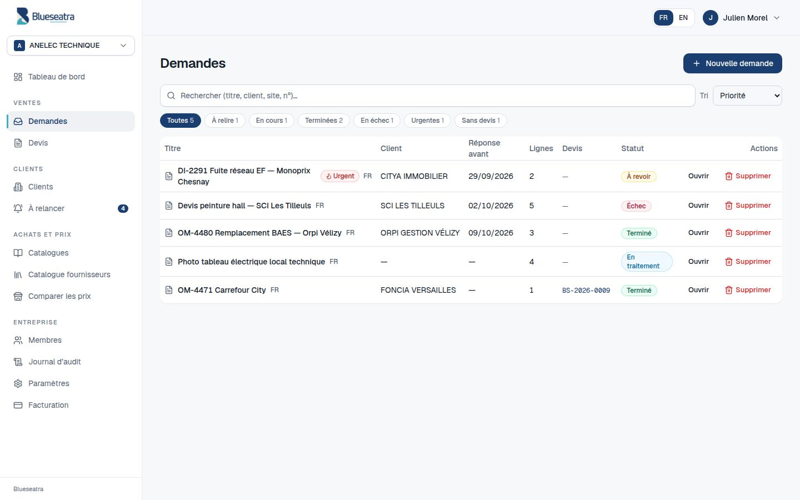

- **Recherche :** par titre, client, site, numéro de demande ou numéro de devis, avec ou sans accents.
- **Filtres :** Toutes, À relire, En cours, Terminées, En échec, Urgentes et Sans devis, avec le nombre de demandes pour chacun.
- **Tri par priorité (par défaut) :**
  1. les demandes à relire ou en échec ;
  2. puis les demandes urgentes ;
  3. puis les demandes terminées sans devis ;
  4. puis celles dont la date de réponse approche.
- **Autres tris :** plus récentes, ou échéance la plus proche.
- **Colonnes :** client, date de réponse attendue et devis déjà créés (un clic ouvre le devis).

### Lire le résultat

- **Statut et confiance :** « Terminé » lorsque la lecture est complète, « À relire » lorsque l'IA a des doutes. Le pourcentage de confiance est affiché à côté.
- **Données extraites :** donneur d'ordre, client final, numéro de demande, date de réponse, langue, site, urgence et lignes de travaux. Tout est modifiable ; cliquez ensuite sur **Enregistrer les modifications**.
- **Extraction IA :** le texte lu dans le document, pour contrôler ce que l'IA a compris.
- **Brouillon généré automatiquement :** dès que la lecture aboutit, un brouillon de devis est créé. Son numéro s'affiche sous le titre.
- **Clients détectés dans cette demande :** voir la section [9.4](#94-suggestions-de-lia).
- **Retraiter :** relance la lecture, par exemple après avoir corrigé le texte.
- **Générer un autre devis :** crée une variante, par exemple une option A ou une option B.

## 6. Devis : vérifier, ajuster, valider, envoyer

### Liste des devis

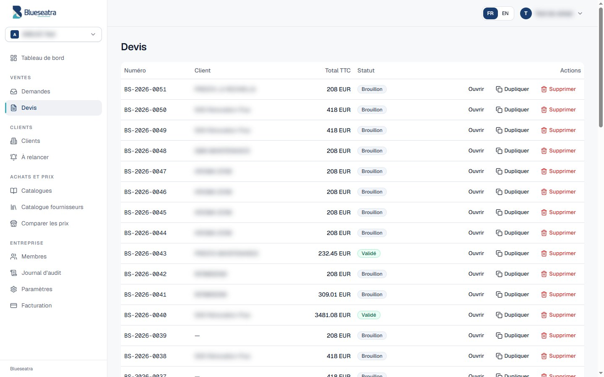

La liste affiche le numéro, le client, le total TTC et le statut : **Brouillon**, **Validé** ou **Envoyé**. Chaque ligne peut être ouverte ou dupliquée.

### Éditeur de devis

**Barre d'actions**

| Bouton | Effet |
|---|---|
| **Enregistrer** | Sauvegarde le brouillon |
| **Valider** | Fige le devis après votre contrôle ; il peut ensuite être envoyé |
| **Recalculer le catalogue** | Réapplique les prix de la version active du catalogue |
| **Dupliquer** | Crée une copie, pratique pour une variante |
| **Télécharger PDF** | Produit le devis Pro Forma à votre en-tête |

**Lignes du devis**

- **Types de ligne :** lot, sous-lot, matériau, main-d'œuvre, déplacement, note et saut de page. Les lots et sous-lots sont numérotés automatiquement (1, 1.1, 1.2…).
- **Ajouter depuis le catalogue :** recherche un article dans vos catalogues et dans le catalogue fournisseurs.
- **Colonnes :** quantité, unité, prix unitaire, marge (jamais imprimée sur le PDF), TVA et total.
- **Colonne Rapprochement :**
  - « Proposé » : l'article vient du catalogue ;
  - « À confirmer » : aucun prix n'a été trouvé, saisissez-le ou choisissez un article.

**Panneau de droite**

- Objet, description du déroulement des travaux, client, site et client final.
- Totaux HT, TVA et TTC.
- **Source tarifaire :** le catalogue et la version utilisés. Les prix sont figés dans le devis au moment du calcul.

**Taux de TVA bâtiment disponibles :** 20 %, 10 %, 5,5 % et 0 %.

### Historique des versions

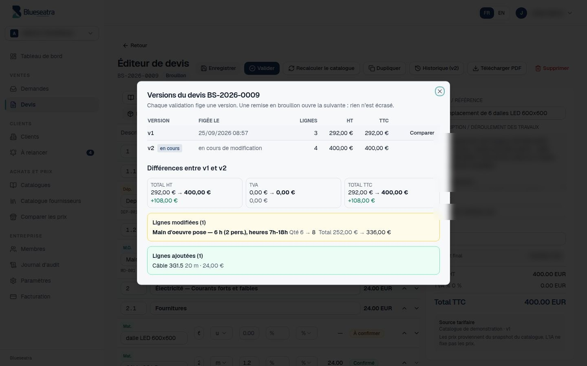

- **Création des versions :** chaque **validation** fige une version du devis (v1, v2…). **Remettre en brouillon** ouvre la version suivante ; la version précédente reste consultable et n'est jamais écrasée.
- **Bouton « Historique » :** il liste les versions avec leur date, le nombre de lignes et les totaux HT et TTC.
- **Comparer :** affiche l'écart des totaux, les champs d'en-tête modifiés, ainsi que les lignes modifiées (avant → après), ajoutées et retirées.

### Client et suivi

Le panneau **Client et suivi** relie le devis à votre fichier clients :

- **Donneur d'ordre** et **client final** : choisis parmi vos fiches.
- **Valable jusqu'au :** la date de validité, qui sert aussi au rappel d'expiration.
- **Issue :** **Accepté**, **Refusé** ou **Sans suite**, avec un motif facultatif. L'issue arrête les relances et alimente les indicateurs de la fiche client.
- **Relances prévues** pour ce devis.

### Cycle de vie d'un devis

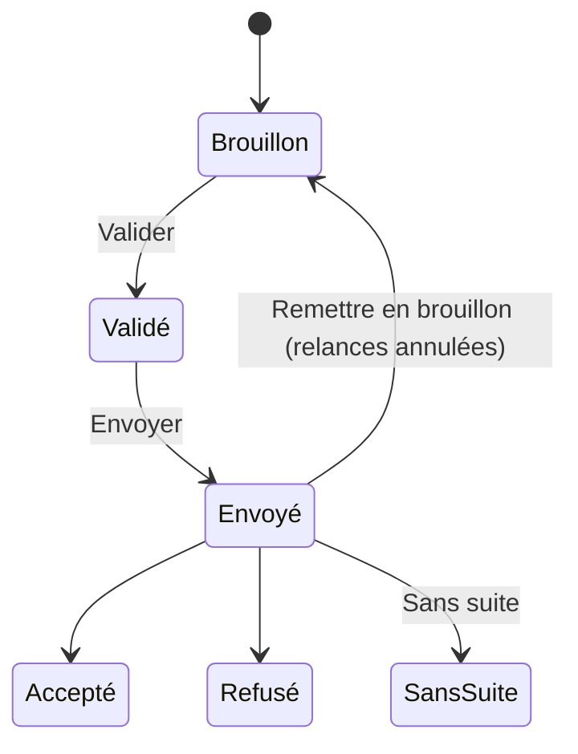

## 7. Catalogues sur mesure

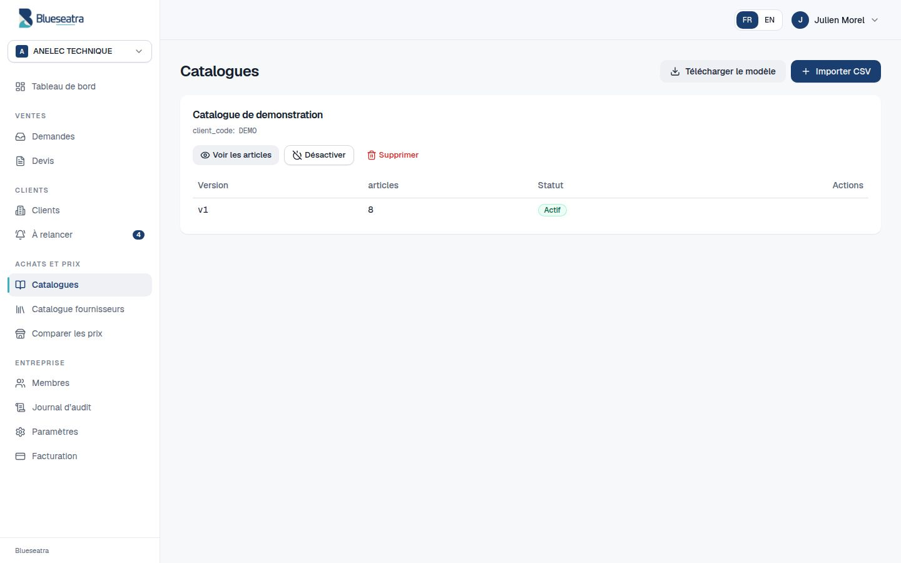

Vos propres tarifs ne sont visibles que par votre entreprise.

1. Cliquez sur **Télécharger le modèle** pour obtenir un fichier CSV d'exemple, ou utilisez directement votre propre fichier.
2. Cliquez sur **Importer CSV**. Toutes les colonnes sont acceptées : Blueseatra détecte les champs utiles (désignation, prix, unité, TVA, référence…) et vous pouvez corriger la correspondance.
3. **Versions :** chaque import crée une version. Vous choisissez celle qui est active ; les anciennes restent consultables.
4. **Contrôle avant activation :** l'import crée une version en brouillon. Blueseatra la compare à la version active (articles nouveaux, retirés, hausses et baisses de prix), puis rend un verdict :
   - **OK** : rien à signaler ;
   - **À vérifier** : prix manquants, unités inconnues, fortes variations ;
   - **Bloquant** : version vide, prix négatifs, trop de rejets, ou beaucoup moins d'articles qu'avant.

   Cliquez ensuite sur **Activer cette version**, ou gardez-la en brouillon. Une version bloquante ne peut être activée que par un propriétaire ou un administrateur, avec **Forcer l'activation**.

   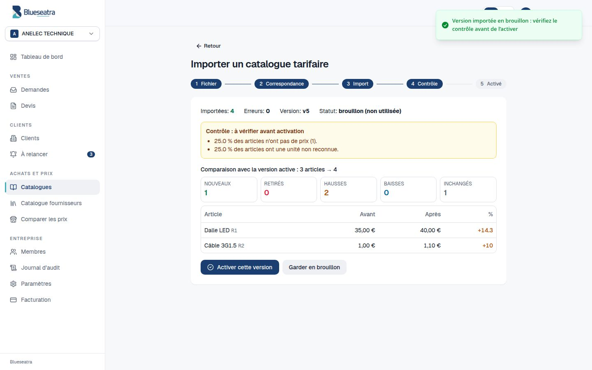
5. **Voir les articles**, **Désactiver** : un catalogue désactivé n'est plus utilisé pour les nouveaux devis.

## 8. Catalogue fournisseurs et comparateur de prix

- **Catalogue fournisseurs :** environ 967 000 références de 9 distributeurs : Rexel, Prolians, Point.P, YESSS, La Plateforme du Bâtiment, Au Forum du Bâtiment, SFIC, Chausson Matériaux et Icilux. Les produits s'affichent page par page, avec des filtres par famille et par mot-clé.
- **Catalogue commun :** il est partagé par toutes les entreprises. Vous pouvez **masquer** un fournisseur pour votre entreprise ; le catalogue commun n'est jamais supprimé.
- **Comparer les prix :** recherchez un produit (par exemple « dalle LED 600x600 ») pour voir le moins cher chez chaque fournisseur. Les critères de la recherche (puissance, dimensions, marque) sont isolés.

## 9. Clients

### 9.1 Liste des clients

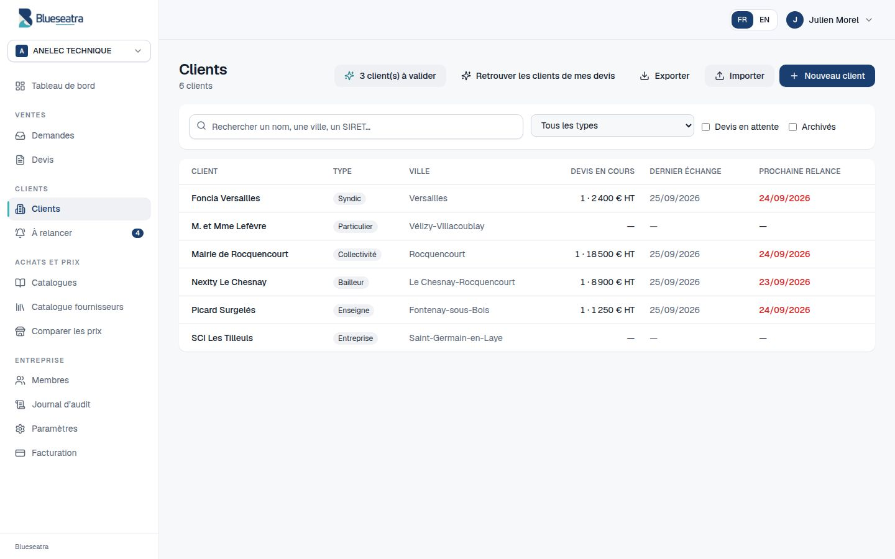

- **Recherche :** par nom, ville, SIRET ou e-mail, avec ou sans accents.
- **Filtres :** type de client (entreprise, particulier, syndic, bailleur, collectivité, enseigne) et clients archivés.
- **Nouveau client :** la raison sociale suffit. Un SIRET déjà utilisé par une autre fiche est refusé, pour éviter les doublons.
- **Importer :** un fichier CSV, avec un aperçu avant l'enregistrement.
- **Exporter :** toute la liste en CSV.
- **Retrouver les clients de mes devis :** propose une fiche pour chaque nom déjà saisi dans vos anciens devis. Chaque proposition est à valider.

### 9.2 Fiche client

| Onglet | Contenu |
|---|---|
| **Vue d'ensemble** | Coordonnées ; devis signés, devis en attente, taux de transformation et délai moyen de réponse |
| **Contacts** | Personnes du client, contact principal, langue, accord pour les relances |
| **Chantiers** | Sites d'intervention, code site, consignes d'accès |
| **Demandes et devis** | Tout l'historique commercial du client |
| **Échanges** | Journal des appels, e-mails, visites et notes. Une erreur se corrige en ajoutant une correction : l'historique n'est jamais réécrit |
| **Relances** | Relances prévues, faites ou annulées |

**Archiver** retire le client des listes et arrête ses relances ; **Restaurer** le remet en place. Un client n'est jamais supprimé.

### 9.3 Protection des données personnelles

- **Opposition aux relances :** décochez « Accepte les relances » sur le contact. Blueseatra crée alors une simple tâche interne, jamais d'e-mail.
- **Anonymiser :** efface le nom, l'e-mail et les téléphones d'un contact, tout en conservant l'historique chiffré des devis. L'action est définitive.

### 9.4 Suggestions de l'IA

Après la lecture d'une demande, Blueseatra propose le donneur d'ordre et le client final, en citant la phrase du document qui justifie chaque proposition.

- **Rattachement automatique :** seulement quand le SIRET ou l'adresse e-mail est identique à une fiche existante. Il reste annulable d'un clic.
- **Correspondance probable ou faible :** vous choisissez de **Créer le client**, de le rattacher à une fiche existante ou d'**Ignorer** la proposition.
- **Toutes les suggestions en attente** sont regroupées sur l'écran **Clients → Suggestions**.

## 10. À relancer

### Quand les relances sont prévues

Les relances sont créées automatiquement quand un devis passe au statut **Envoyé**.

| Situation | Calendrier par défaut |
|---|---|
| Devis ordinaire | 3 jours ouvrés après l'envoi, puis 7, puis 14 |
| Demande urgente | 1 jour ouvré, puis 2, puis 4 |
| Date de validité renseignée | Rappel 3 jours ouvrés avant l'expiration |
| Total supérieur à 10 000 € HT, ou contact sans e-mail | Appel plutôt qu'e-mail |

Les **jours ouvrés** excluent les samedis, les dimanches et les 11 jours fériés nationaux.

**Exemple :** un devis de 2 400 € HT envoyé le jeudi 24/09/2026 est relancé le mardi 29/09, le jeudi 08/10, puis le mercredi 28/10, à 9 h.

### Traiter une relance

- **Regroupement :** l'écran classe les relances en **En retard**, **Aujourd'hui** et **Cette semaine**. Chaque carte affiche la raison, par exemple « Devis D-2026-041 envoyé le 24/09/2026, sans réponse : relance 1 sur 3 ».
- **Ouvrir l'e-mail :** prépare un message en français ou en anglais, selon la langue du contact. Il cite le numéro et la date du devis, jamais un montant recalculé.
- **Appeler :** affiche le numéro du contact, ou celui du client à défaut.
- **Marquer faite :** enregistre le résultat de la relance.
  - « À rappeler » crée une tâche le jour ouvré suivant.
  - « Sans réponse » et « En réflexion » laissent le calendrier continuer.
  - « Accepté » et « Refusé » clôturent le devis.
- **Reporter :** déplace la relance à une autre date.

### Quand les relances s'arrêtent

Les relances s'arrêtent dans les cas suivants :

- le devis est accepté, refusé ou sans suite ;
- il est remis en brouillon ;
- le client est archivé ;
- les relances sont désactivées.

Elles passent alors à « annulée » avec leur motif ; elles ne sont jamais supprimées.

### Réglages des relances

Le bouton **Réglages des relances** est réservé au propriétaire et aux administrateurs. Il permet de régler :

- l'activation des relances ;
- les délais normaux et urgents ;
- le nombre maximal de relances ;
- la validité par défaut des devis ;
- le rappel avant expiration ;
- le seuil au-dessus duquel un appel est proposé ;
- l'heure des relances.

## 11. Membres et rôles

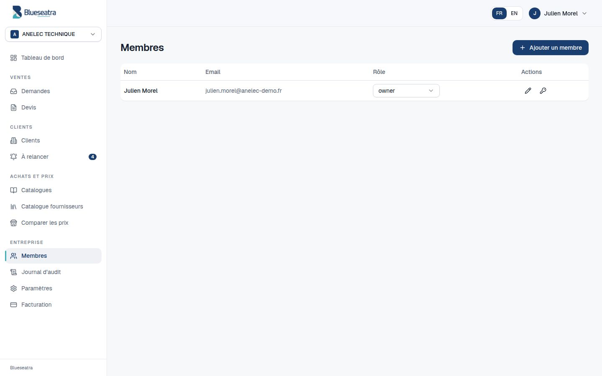

| Rôle | Peut faire |
|---|---|
| **owner** (propriétaire) | Tout, y compris gérer les membres, changer les mots de passe et choisir l'offre |
| **admin** | Gérer les membres, les paramètres, les catalogues et les réglages de relance |
| **operator** (chiffreur) | Créer des demandes, des devis et des clients, traiter les relances |
| **viewer** (lecteur) | Consulter sans rien modifier |
| **billing_admin** | Gérer l'offre et la facturation |

Cliquez sur **Ajouter un membre**, puis indiquez son e-mail et son rôle. Chaque membre compte comme un siège de votre offre.

## 12. Paramètres

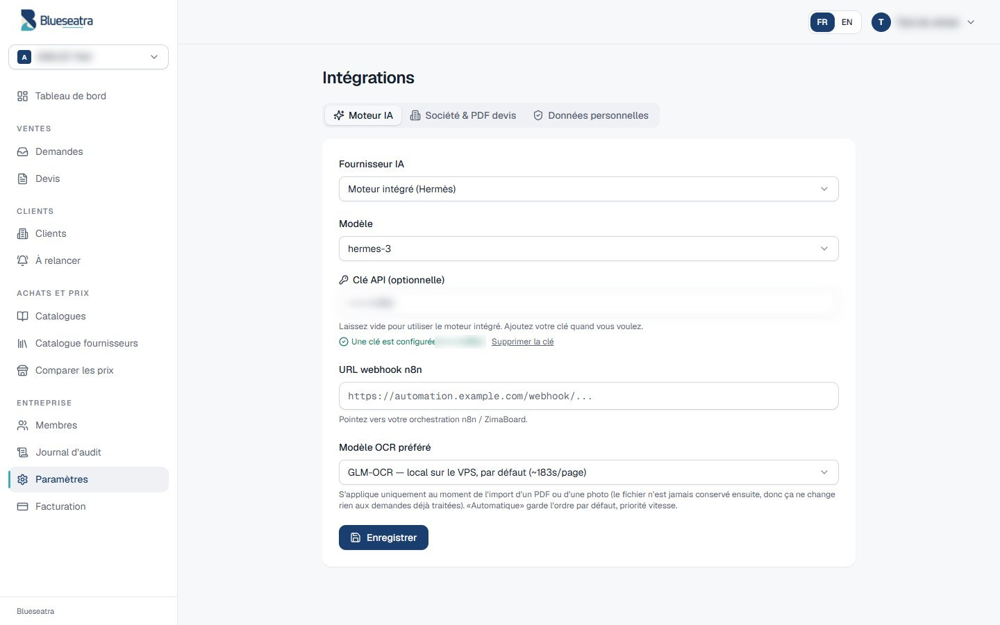

- **Moteur IA :** Blueseatra utilise par défaut son propre moteur, hébergé sur un serveur OVH. Vous pouvez choisir un autre fournisseur et ajouter votre clé ; elle est chiffrée avant d'être enregistrée.
- **Modèle OCR préféré :** le mode « Automatique » est conseillé.
- **Webhook n8n :** une adresse appelée après les étapes clés, pour automatiser la suite (e-mail, tableur, CRM).

- **Données personnelles** (propriétaire et administrateurs) :
  - **Télécharger l'export** : toutes les données de l'entreprise dans un fichier zip ;
  - **Anonymiser** une personne à partir de son adresse e-mail (droit à l'effacement) ;
  - liste des contacts dont le client est archivé depuis plus de 3 ans.
  Chaque opération est inscrite au journal d'audit.
- **Société & PDF devis :** raison sociale, SIRET, TVA intracommunautaire, adresse, IBAN, logo, mentions et conditions de paiement. Ces informations sont imprimées sur chaque PDF ; renseignez-les avant votre premier envoi.

## 13. Offre et consommation

- **Offre actuelle** et date de fin d'essai.
- **Compteurs :**
  - **devis assistés par l'IA** ;
  - **pages lues**, uniquement pour les photos et les PDF scannés ;
  - **sièges**.
- **Ce qui n'est jamais compté :** les devis manuels, les PDF, les catalogues et le comparateur de prix, qui sont illimités.
- **Historique de consommation :** chaque écriture est conservée. Une extraction qui échoue est remboursée.

| Offre | Prix HT / mois | Sièges | Devis assistés IA | Pages lues |
|---|---:|---:|---:|---:|
| Découverte | Essai 14 jours | 1 | 10 | 30 |
| Initial | 59 € | 1 | 60 | 150 |
| Pilotage | 149 € | 3 | 250 | 750 |
| Performance | 399 € | 10 | 1 000 | 3 000 |
| Signature | Sur devis | Contrat | Contrat | Contrat |

Détail des offres : [`tarification-2026-09.md`](./tarification-2026-09.md).

## 14. Journal d'audit

Le **Journal d'audit** liste les actions sensibles de votre entreprise : qui a fait quoi et quand. On y trouve par exemple la création ou la validation d'un devis, un import de catalogue, un changement de rôle, l'archivage ou l'anonymisation. L'application n'offre aucune fonction pour modifier ou effacer une entrée.

## 15. Questions fréquentes

**L'IA peut-elle inventer un prix ?**
Non. Les prix viennent uniquement de vos catalogues et du catalogue fournisseurs. Sans prix trouvé, la ligne reste « À confirmer ».

**Un PDF texte consomme-t-il des pages lues ?**
Non. Seuls les photos et les PDF scannés comptent.

**Puis-je supprimer un client ?**
Non : vous pouvez l'archiver, puis le restaurer à tout moment. Pour les données personnelles d'un contact, utilisez **Anonymiser** sur la fiche, ou **Paramètres → Données personnelles** pour toutes les fiches d'une même adresse e-mail.

**Mes données sont-elles visibles par d'autres entreprises ?**
Non. Chaque entreprise est isolée au niveau de la base de données. Seul le catalogue fournisseurs commun est partagé.

**Le PDF n'affiche pas mon SIRET ou mon logo.**
Renseignez **Paramètres → Société & PDF devis**.

**Une demande reste « À relire ».**
Corrigez les champs signalés, puis enregistrez. Vous pouvez aussi cliquer sur **Retraiter**.

---

Besoin d'aide : contactez l'équipe Blueseatra depuis [blueseatra.com](https://blueseatra.com).
