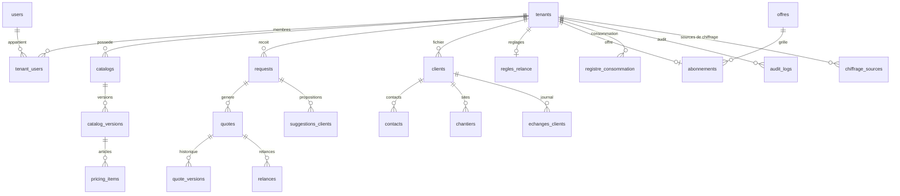

# Schéma de base de données

État du schéma `blueseatra` (Supabase, PostgreSQL 17) au **01/10/2026**, après la migration `20261001120000_sources_chiffrage_fournisseurs.sql`. Source de vérité : les migrations de [`supabase/migrations`](../supabase/migrations/). Ce document sert de vue d'ensemble ; pour une colonne précise, interroger `information_schema.columns`.

- Toutes les tables métier portent `tenant_id` et sont protégées par RLS sous le rôle `blueseatra_app` (sauf le catalogue commun, visible à toutes les entreprises).
- Isolation à deux niveaux : filtre `tenant_id` dans le code **et** RLS imposé par PostgreSQL.

## Vue d'ensemble

Autres tables : `import_jobs`, `import_errors`, `settings_integrations` (clé IA chiffrée Fernet), `company_profiles`, et les tables du catalogue fournisseurs : `suppliers`, `supplier_offers`, `canonical_products`, `product_match_rules`, `unit_conversions`, `tenant_catalogue_commun`, `catalogue_commun_masque`.

---

## Chiffrage sur catalogue interne

### `catalogs`

Catalogues tarifaires internes importés par l'entreprise (CSV). Colonne d'activation `active_version_id` : le bouton « Utiliser pour le chiffrage » de la page Catalogues l'alimente ou le vide — **aucune ligne n'est jamais supprimée**.

| Colonne | Type | Null | Défaut | Rôle |
|---|---|---|---|---|
| `id` | varchar | non | — | Identifiant |
| `tenant_id` | varchar | non | — | Entreprise (RLS) |
| `name` | varchar | non | — | Nom affiché |
| `client_code` | varchar | oui | `N/A` | Code client donneur d'ordre |
| `active_version_id` | varchar | oui | — | Version active pour le chiffrage (null = inactif) |
| `created_at` | varchar (ISO UTC) | oui | — | Création |

### `catalog_versions`

Versions successives d'un catalogue (brouillon → activée). `columns`/`mapping` (jsonb) décrivent le mapping dynamique des colonnes du CSV d'origine.

| Colonne | Type | Null | Défaut | Rôle |
|---|---|---|---|---|
| `id` | varchar | non | — | Identifiant |
| `tenant_id` | varchar | non | — | Entreprise (RLS) |
| `catalog_id` | varchar | non | — | Catalogue parent |
| `version_number` | entier | oui | `1` | Numéro |
| `status` | varchar | oui | `draft` | `draft` / `active` |
| `item_count` | entier | oui | `0` | Lignes valides |
| `error_count` | entier | oui | `0` | Lignes rejetées |
| `columns` | jsonb | oui | — | Colonnes détectées |
| `mapping` | jsonb | oui | — | Mapping vers `pricing_items` |
| `source_filename` | varchar | oui | — | Fichier importé |
| `created_at` | varchar (ISO UTC) | oui | — | Création |
| `activated_at` | varchar (ISO UTC) | oui | — | Activation |

### `pricing_items`

Articles du catalogue interne : prix d'achat, marge, prix de vente HT — l'entreprise garde la maîtrise de ses prix. `label_norm` sert au rapprochement (index trigramme).

| Colonne | Type | Null | Défaut | Rôle |
|---|---|---|---|---|
| `id` | varchar | non | — | Identifiant |
| `tenant_id` | varchar | non | — | Entreprise (RLS) |
| `catalog_id`, `version_id` | varchar | oui | — | Rattachement |
| `item_code`, `item_label`, `label_norm` | varchar / text | oui | — | Code, libellé, libellé normalisé |
| `category`, `family` | varchar | oui | — | Famille de lot TCE |
| `unit` | varchar | oui | — | Unité de vente |
| `brand`, `reference` | varchar | oui | — | Marque, référence |
| `supplier_main`, `suppliers` | varchar / jsonb | oui | — | Fournisseur principal, historique |
| `vat_rate` | double | oui | `20` | TVA |
| `margin` | double | oui | `0` | Marge |
| `purchase_price_ht`, `unit_price_ht` | double | oui | — | Prix d'achat / vente HT |
| `currency` | varchar | oui | `EUR` | Devise |
| `min_qty` | double | oui | `1` | Quantité minimum |
| `is_active` | booléen | oui | `true` | Actif |
| `delay`, `notes`, `attributes` | varchar / text / jsonb | oui | — | Délai, notes, attributs libres |

---

## Chiffrage sur catalogues fournisseurs

### `chiffrage_sources` (migration `20261001120000`)

Boutons poussoirs « activer / désactiver pour le chiffrage » par catalogue fournisseur. **Aucune donnée n'est copiée ni supprimée** : seul l'état bascule, RLS par entreprise, clé primaire `(tenant_id, cle)`. `cle` = `version_id` du catalogue fournisseur (UUID unique) ou `hist:<supplier_id>` pour un fournisseur sans version.

| Colonne | Type | Null | Défaut | Rôle |
|---|---|---|---|---|
| `tenant_id` | varchar | non | — | Entreprise (RLS) |
| `cle` | varchar | non | — | Source : `version_id` ou `hist:<supplier_id>` |
| `actif` | booléen | non | `true` | Activé pour le chiffrage des devis |
| `cree_le`, `maj_le` | varchar (ISO UTC) | oui | — | Horodatages |
| `par` | varchar | oui | — | Auteur de la dernière bascule |

### `suppliers`

Fournisseurs (catalogue commun et propres). `discount_rules`/`agencies` en jsonb.

| Colonne | Type | Null | Défaut | Rôle |
|---|---|---|---|---|
| `id` | varchar | non | — | Identifiant |
| `tenant_id` | varchar | non | — | Entreprise (ou tenant du catalogue commun) |
| `name` | varchar | non | — | Nom |
| `slug` | varchar | oui | — | Slug |
| `website` | text | oui | — | Site |
| `franco_ht`, `shipping_cost_ht` | double | oui | — | Franco et port |
| `discount_rules` | jsonb | non | `{}` | Barèmes de remises |
| `default_delay` | varchar | oui | — | Délai |
| `agencies` | jsonb | non | `[]` | Agences |
| `notes` | text | oui | — | Notes |
| `is_active` | booléen | non | `true` | Actif |
| `created_at`, `updated_at` | varchar (ISO UTC) | non | now() | Horodatages |

### `supplier_offers`

Offres des catalogues fournisseurs (~970 000 lignes actives). Recherche en **deux temps** : filtre trigramme sur `recherche_norm` (index GIN `idx_offers_recherche_trgm`) dans une sous-requête sans tri, puis tri par prix sur le petit résultat (index `idx_offers_recherche_prix_v2` pour le sélecteur paginé). Un `ORDER BY price` dans la branche filtrante faisait parcourir tout l'index par prix et dépassait le `command_timeout` de 30 s (correctif PR #133).

| Colonne | Type | Null | Défaut | Rôle |
|---|---|---|---|---|
| `id` | varchar | non | — | Identifiant |
| `tenant_id` | varchar | non | — | Entreprise (ou tenant du catalogue commun) |
| `supplier_id` | varchar | non | — | Fournisseur |
| `catalog_id`, `version_id` | varchar | oui | — | Version d'import |
| `raw_label`, `raw_reference`, `raw_unit`, `raw_row` | text / varchar / jsonb | oui | — | Données brutes du catalogue source |
| `label_norm`, `recherche_norm` | text | oui | — | Libellés normalisés (recherche) |
| `designation_courte` | text | oui | — | Désignation courte |
| `brand`, `manufacturer_ref`, `ean` | varchar | oui | — | Marque, référence fabricant, EAN |
| `unit_canonical`, `packaging_qty`, `min_qty` | varchar / double | oui / non | — / `1` | Unité canonique, conditionnement, quantité mini |
| `price_ht`, `price_ht_per_unit` | double | oui | — | Prix HT (brut / par unité) |
| `currency` | varchar | non | `EUR` | Devise |
| `vat_rate` | double | oui | — | TVA |
| `discount_applied` | double | oui | — | Remise appliquée |
| `delay`, `availability`, `product_url` | varchar / text | oui | — | Délai, disponibilité, lien produit |
| `source_date`, `source_filename` | varchar / text | oui | — | Provenance du tarif |
| `canonical_product_id` | varchar | oui | — | Produit canonique (rapprochement) |
| `match_status` | varchar | non | `orphan` | `orphan` / `matched`… |
| `match_confidence`, `match_rule_id`, `match_reasons`, `matched_at`, `matched_by` | entier / varchar / jsonb / timestamptz | oui | — | Preuves du rapprochement |
| `is_active` | booléen | non | `true` | Offre active |
| `type_produit`, `calibre`, `courbe`, `poles`, `pouvoir_coupure`, `sensibilite`, `section`, `puissance`, `temperature` | varchar | oui | — | Attributs techniques électriques |
| `conditionnement_lot` | entier | oui | — | Conditionnement par lot |
| `est_accessoire`, `est_courant_continu` | booléen | non | `false` | Classifications |
| `created_at` | varchar (ISO UTC) | non | now() | Création |

---

## Devis

### `quotes`

Brouillons et devis validés. `pricing_snapshot` (jsonb) fige les prix au moment de la génération et trace la **provenance** : catalogue interne, ou `Catalogues fournisseurs` avec le drapeau `sources_fournisseurs` quand les sources activées ont servi au rapprochement (remplacent le catalogue interne s'il n'y en a pas — le refus n'a lieu que si l'entreprise n'a ni catalogue interne ni source activée).

| Colonne | Type | Null | Rôle |
|---|---|---|---|
| `id`, `tenant_id`, `request_id` | varchar | non | Identifiants, demande d'origine |
| `number` | varchar | oui | `BS-AAAA-NNNN` |
| `status` | varchar | oui | `draft` / `validated` / `sent`… |
| `version` | entier | oui | Version courante |
| `client`, `client_final`, `site`, `object`, `language` | text / varchar | oui | En-tête du devis |
| `meta`, `lines` | jsonb | oui | Méta, lignes de devis |
| `total_ht`, `total_vat`, `total_ttc` | double | oui | Totaux |
| `currency` | varchar | oui | Devise |
| `pricing_snapshot` | jsonb | oui | Prix figés + provenance |
| `client_id`, `client_final_id`, `chantier_id`, `contact_id` | varchar | oui | Liens module Clients |
| `created_by`, `created_at`, `validated_at`, `sent_at` | varchar | oui | Cycle de vie |
| `issue`, `issue_le`, `motif_issue` | varchar / timestamptz | oui | Envoyé au client le |
| `valable_jusqu_au` | date | oui | Validité |

### `quote_versions`

Historique des versions émises d'un devis (ajout seul).

| Colonne | Type | Null | Rôle |
|---|---|---|---|
| `id`, `tenant_id`, `quote_id` | varchar | non | Identifiants |
| `version` | entier | oui | Numéro de version |
| `snapshot` | jsonb | oui | Contenu figé de la version |
| `created_at` | varchar (ISO UTC) | oui | Création |

---

## Rappels

- **Aucune suppression silencieuse** : désactiver une source ou un catalogue ne supprime aucune ligne ; le catalogue commun est masquable (`catalogue_commun_masque`) mais jamais supprimé.
- **L'IA ne fixe jamais un prix** : les prix viennent de `pricing_items` ou des `supplier_offers` des sources activées ; marges, remises et TVA sont calculées par `matching.py`.
- **Registre et audit en ajout seul** : `registre_consommation` et `audit_logs` sont protégés par trigger contre la modification et la suppression. Les bascules de sources de chiffrage y sont journalisées (`chiffrage.source.activer` / `chiffrage.source.desactiver`).
